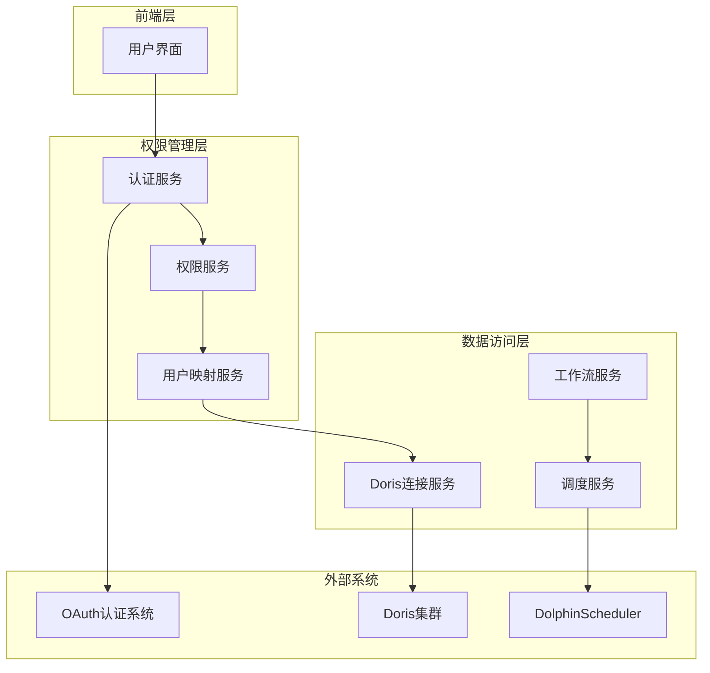

# 数据中台权限管理系统设计文档

## 概述

数据中台权限管理系统旨在为现有的数据平台提供统一的访问控制能力。系统将集成现有的OAuth认证体系，通过多种权限管理方案实现对Doris数据库和工作流资源的细粒度访问控制。

本设计提供了四种不同的权限管理方案，每种方案都有其适用场景和优缺点，可以根据实际需求选择最合适的方案。

## 架构

### 整体架构



## 组件和接口

### 核心组件

#### 1. 认证服务 (AuthService)
- 集成OAuth系统
- 管理用户会话
- 提供用户身份验证

#### 2. 权限服务 (PermissionService)
- 管理用户角色和权限
- 提供权限验证接口
- 处理权限变更通知

#### 3. 用户映射服务 (UserMappingService)
- 管理平台用户与Doris用户的映射关系
- 提供凭据选择逻辑
- 维护权限缓存

#### 4. 增强的DorisConnectionService
- 集成权限验证
- 支持多用户凭据
- 提供权限过滤功能

### 接口设计

```java
// 权限服务接口（基于现有元数据）
public interface PermissionService {
    boolean hasPermission(String userId, String resource, String action);
    boolean canExecuteSql(String userId, String database, String sql);
    List<String> getAccessibleDatabases(String userId);
    List<DataTable> getAccessibleTables(String userId, String database);
    List<DataTable> getAccessibleTablesByDomain(String userId, String businessDomain, String dataDomain);
    List<DataTable> getAccessibleTablesByLayer(String userId, String layer);
    List<DataTask> getAccessibleWorkflows(String userId);
    void grantDatabasePermission(String userId, String database, PermissionLevel level);
    void grantDomainPermission(String userId, String domainType, String domainValue, PermissionLevel level);
    void grantTablePermission(String userId, Long tableId, PermissionLevel level);
}

// SQL权限验证服务接口
public interface SqlPermissionService {
    void validateSqlPermission(String userId, String sql, String database) throws PermissionDeniedException;
    SqlOperationType parseSqlOperation(String sql);
    boolean requiresApproval(String userId, String sql, String database);
    void logOperation(String userId, String database, String sql, SqlOperationType operation, boolean success);
}

// 用户映射服务接口
public interface UserMappingService {
    DorisCredential getDorisCredential(String userId, String database, SqlOperationType operation);
    void createUserMapping(String userId, String database, PermissionLevel level);
    void updateUserMapping(String userId, String database, PermissionLevel level);
}

// 增强的Doris连接服务接口
public interface EnhancedDorisConnectionService {
    Connection getConnection(String userId, String database, SqlOperationType operation) throws SQLException;
    SqlQueryResponse executeQuery(String userId, SqlQueryRequest request) throws SQLException, PermissionDeniedException;
    List<String> getAllDatabases(String userId);
    List<Map<String, Object>> getTablesInDatabase(String userId, String database);
}

// 操作审批服务接口
public interface OperationApprovalService {
    String submitApprovalRequest(String userId, String sql, String database, String reason);
    void approveOperation(String approvalId, String approverId);
    void rejectOperation(String approvalId, String approverId, String reason);
    List<DangerousOperationApproval> getPendingApprovals(String approverId);
}
```

## 数据模型

### 简化的权限数据模型

```sql
-- 1. 用户表
CREATE TABLE platform_users (
    id VARCHAR(64) PRIMARY KEY,
    oauth_user_id VARCHAR(128) UNIQUE NOT NULL,
    username VARCHAR(64) NOT NULL,
    email VARCHAR(128),
    created_at TIMESTAMP DEFAULT CURRENT_TIMESTAMP,
    updated_at TIMESTAMP DEFAULT CURRENT_TIMESTAMP ON UPDATE CURRENT_TIMESTAMP
);

-- 2. Doris数据库用户配置表（每个数据库的标准用户）
CREATE TABLE doris_database_users (
    id BIGINT AUTO_INCREMENT PRIMARY KEY,
    cluster_id BIGINT NOT NULL,
    database_name VARCHAR(64) NOT NULL,
    readonly_username VARCHAR(64) NOT NULL,
    readonly_password VARCHAR(128) NOT NULL,
    readwrite_username VARCHAR(64) NOT NULL,
    readwrite_password VARCHAR(128) NOT NULL,
    created_at TIMESTAMP DEFAULT CURRENT_TIMESTAMP,
    FOREIGN KEY (cluster_id) REFERENCES doris_cluster(id),
    UNIQUE KEY uk_cluster_database (cluster_id, database_name)
);

-- 3. 用户数据库权限表（核心权限控制）
CREATE TABLE user_database_permissions (
    id BIGINT AUTO_INCREMENT PRIMARY KEY,
    user_id VARCHAR(64) NOT NULL,
    cluster_id BIGINT NOT NULL,
    database_name VARCHAR(64) NOT NULL,
    permission_level ENUM('readonly', 'readwrite') NOT NULL,
    granted_at TIMESTAMP DEFAULT CURRENT_TIMESTAMP,
    granted_by VARCHAR(64), -- 授权人
    expires_at TIMESTAMP NULL, -- 权限过期时间
    FOREIGN KEY (user_id) REFERENCES platform_users(id),
    FOREIGN KEY (cluster_id) REFERENCES doris_cluster(id),
    FOREIGN KEY (granted_by) REFERENCES platform_users(id),
    UNIQUE KEY uk_user_database (user_id, cluster_id, database_name)
);
```

## 行业调研：标准数据中台权限管理

### 主流数据中台权限管理模式

#### 1. 阿里云DataWorks模式
- **多租户隔离**：通过工作空间(Workspace)实现租户隔离
- **RBAC权限模型**：角色-权限-资源三层模型
- **数据分级分类**：敏感数据、内部数据、公开数据分级管理
- **字段级权限**：支持表级、字段级、行级权限控制
- **审批流程**：数据访问需要经过审批流程

#### 2. 腾讯云数据湖模式
- **统一身份认证**：集成企业AD/LDAP
- **资源标签管理**：通过标签实现资源分组和权限控制
- **数据血缘权限**：基于数据血缘关系的权限传播
- **动态权限**：基于时间、地理位置等条件的动态权限

#### 3. 华为云DataArts模式
- **数据域管理**：按业务域划分数据权限
- **数据资产目录**：通过数据目录实现权限可视化管理
- **API权限管控**：对数据API的访问进行权限控制
- **数据脱敏**：自动数据脱敏和加密

#### 4. Apache Atlas + Ranger模式（开源方案）
- **元数据驱动**：基于元数据的权限管理
- **策略引擎**：灵活的权限策略配置
- **审计日志**：完整的数据访问审计
- **多引擎支持**：支持Hive、HBase、Kafka等多种数据引擎

### 增删改查操作控制的行业实践

#### 1. 基于SQL解析的操作控制
- **SQL语句分析**：解析SQL语句识别操作类型（SELECT、INSERT、UPDATE、DELETE、CREATE、DROP等）
- **白名单机制**：只允许特定用户执行特定类型的SQL操作
- **危险操作拦截**：自动拦截DROP、TRUNCATE等危险操作
- **批量操作限制**：限制批量删除、更新的数据量

#### 2. 基于时间窗口的操作控制
- **操作时间限制**：只允许在特定时间段执行写操作
- **维护窗口**：在维护时间窗口内禁止所有写操作
- **频率限制**：限制用户在单位时间内的操作次数

#### 3. 基于数据量的操作控制
- **查询结果限制**：限制单次查询返回的最大行数
- **影响行数限制**：限制单次UPDATE/DELETE影响的最大行数
- **存储配额**：限制用户可以创建的表的总存储空间

### 数据范围控制的常见方法

#### 1. 基于元数据的权限控制
```sql
-- 数据域表
CREATE TABLE data_domains (
    id BIGINT AUTO_INCREMENT PRIMARY KEY,
    domain_name VARCHAR(64) NOT NULL,
    domain_code VARCHAR(32) UNIQUE NOT NULL,
    description TEXT,
    owner_id VARCHAR(64),
    created_at TIMESTAMP DEFAULT CURRENT_TIMESTAMP
);

-- 数据分类表
CREATE TABLE data_classifications (
    id BIGINT AUTO_INCREMENT PRIMARY KEY,
    classification_name VARCHAR(64) NOT NULL,
    level INT NOT NULL, -- 1:公开, 2:内部, 3:机密, 4:绝密
    description TEXT
);

-- 数据资产表
CREATE TABLE data_assets (
    id BIGINT AUTO_INCREMENT PRIMARY KEY,
    asset_name VARCHAR(128) NOT NULL,
    asset_type ENUM('database', 'table', 'column', 'api') NOT NULL,
    domain_id BIGINT,
    classification_id BIGINT,
    cluster_id BIGINT,
    database_name VARCHAR(64),
    table_name VARCHAR(64),
    column_name VARCHAR(64),
    tags JSON,
    FOREIGN KEY (domain_id) REFERENCES data_domains(id),
    FOREIGN KEY (classification_id) REFERENCES data_classifications(id)
);
```

#### 2. 基于标签的权限控制
```sql
-- 资源标签表
CREATE TABLE resource_tags (
    id BIGINT AUTO_INCREMENT PRIMARY KEY,
    resource_type VARCHAR(32) NOT NULL,
    resource_id VARCHAR(128) NOT NULL,
    tag_key VARCHAR(64) NOT NULL,
    tag_value VARCHAR(128) NOT NULL,
    created_at TIMESTAMP DEFAULT CURRENT_TIMESTAMP,
    UNIQUE KEY uk_resource_tag (resource_type, resource_id, tag_key)
);

-- 用户标签权限表
CREATE TABLE user_tag_permissions (
    id BIGINT AUTO_INCREMENT PRIMARY KEY,
    user_id VARCHAR(64) NOT NULL,
    tag_key VARCHAR(64) NOT NULL,
    tag_value VARCHAR(128) NOT NULL,
    permission_level ENUM('read', 'write', 'admin') NOT NULL,
    FOREIGN KEY (user_id) REFERENCES platform_users(id),
    UNIQUE KEY uk_user_tag (user_id, tag_key, tag_value)
);
```

#### 3. 基于数据血缘的权限传播
```sql
-- 数据血缘关系表
CREATE TABLE data_lineage (
    id BIGINT AUTO_INCREMENT PRIMARY KEY,
    source_asset_id BIGINT NOT NULL,
    target_asset_id BIGINT NOT NULL,
    lineage_type ENUM('direct', 'derived', 'aggregated') NOT NULL,
    transformation_logic TEXT,
    created_at TIMESTAMP DEFAULT CURRENT_TIMESTAMP,
    FOREIGN KEY (source_asset_id) REFERENCES data_assets(id),
    FOREIGN KEY (target_asset_id) REFERENCES data_assets(id)
);

-- 权限继承规则表
CREATE TABLE permission_inheritance_rules (
    id BIGINT AUTO_INCREMENT PRIMARY KEY,
    source_classification_id BIGINT NOT NULL,
    target_classification_id BIGINT NOT NULL,
    inheritance_type ENUM('inherit', 'upgrade', 'downgrade') NOT NULL,
    FOREIGN KEY (source_classification_id) REFERENCES data_classifications(id),
    FOREIGN KEY (target_classification_id) REFERENCES data_classifications(id)
);
```

## 权限管理方案

### 方案一：规范化Doris用户方案（推荐，简单实用）

基于你的思路设计的最简单实用的方案。

#### 设计思路
- 每个数据库维护标准的读写用户和只读用户
- 平台用户通过权限配置映射到相应的Doris用户
- 充分利用Doris原生权限体系控制数据访问范围
- 在平台层控制用户能看到哪些数据库和表

## 需要权限控制的功能点梳理

### 1. 数据库访问功能
#### 1.1 数据库列表查看
- **当前接口**: `GET /v1/doris-clusters/{id}/databases`
- **权限控制**: 只返回用户有权限的数据库列表
- **实现方式**: 根据用户权限过滤数据库列表

#### 1.2 数据库连接
- **当前服务**: `DorisConnectionService.getConnection()`
- **权限控制**: 根据用户权限选择对应的Doris用户凭据
- **实现方式**: 用户权限映射到readonly/readwrite Doris用户

### 2. 表管理功能
#### 2.1 表列表查看
- **当前接口**: `GET /v1/doris-clusters/{id}/databases/{database}/tables`
- **权限控制**: 只返回用户有权限访问的表
- **实现方式**: 基于用户数据库权限过滤表列表

#### 2.2 表统计信息查看
- **当前接口**: `GET /v1/data-tables/{id}/statistics`
- **权限控制**: 验证用户对该表所在数据库的访问权限
- **实现方式**: 检查用户是否有该数据库的访问权限

#### 2.3 表结构查看
- **当前接口**: `GET /v1/data-tables/{id}/ddl`
- **权限控制**: 验证用户对该表的访问权限
- **实现方式**: 检查用户权限后返回DDL

#### 2.4 表数据预览
- **当前接口**: `GET /v1/data-tables/{id}/preview`
- **权限控制**: 验证用户对该表的读取权限
- **实现方式**: 使用用户对应的Doris凭据执行查询

### 3. 数据查询功能
#### 3.1 SQL查询执行
- **当前接口**: `POST /v1/data-query/execute`
- **权限控制**: 验证用户对目标数据库的访问权限和SQL操作权限
- **实现方式**: SQL解析 + 权限验证 + 使用对应Doris用户执行

#### 3.2 查询历史查看
- **当前功能**: 查询历史记录
- **权限控制**: 用户只能看到自己的查询历史
- **实现方式**: 按用户ID过滤查询历史

### 4. 工作流管理功能
#### 4.1 工作流列表查看
- **当前服务**: `DataTaskService.list()`
- **权限控制**: 用户只能看到自己创建的或有权限的工作流
- **实现方式**: 基于owner字段和权限配置过滤

#### 4.2 工作流创建
- **当前接口**: `POST /v1/data-tasks`
- **权限控制**: 验证用户对相关数据源的访问权限
- **实现方式**: 检查用户对涉及数据库的权限

#### 4.3 工作流执行
- **当前功能**: 工作流执行
- **权限控制**: 验证用户对工作流和相关数据源的权限
- **实现方式**: 权限检查 + 使用对应Doris用户执行

### 5. 数据源管理功能
#### 5.1 DolphinScheduler数据源列表
- **当前接口**: `GET /v1/dolphin/datasources`
- **权限控制**: 只返回用户有权限的数据源
- **实现方式**: 基于用户权限过滤数据源列表

#### 增删改查操作控制实现

##### 1. SQL操作分类和权限映射
```java
public enum SqlOperationType {
    SELECT("查询", "read"),
    INSERT("插入", "write"), 
    UPDATE("更新", "write"),
    DELETE("删除", "write"),
    CREATE_TABLE("建表", "admin"),
    DROP_TABLE("删表", "admin"),
    ALTER_TABLE("修改表结构", "admin"),
    TRUNCATE("清空表", "admin");
    
    private final String description;
    private final String requiredPermission;
}
```

##### 2. SQL解析和权限验证
```java
public class SqlPermissionValidator {
    
    public void validateSqlPermission(String userId, String sql, String database) {
        // 1. 解析SQL语句
        SqlOperationType operationType = parseSqlOperation(sql);
        
        // 2. 获取用户对该数据库的权限级别
        PermissionLevel userPermission = getUserPermission(userId, database);
        
        // 3. 验证操作权限
        if (!hasPermissionForOperation(userPermission, operationType)) {
            throw new PermissionDeniedException(
                String.format("用户 %s 没有权限在数据库 %s 执行 %s 操作", 
                    userId, database, operationType.getDescription()));
        }
        
        // 4. 特殊操作额外检查
        performAdditionalChecks(userId, sql, operationType, database);
    }
    
    private void performAdditionalChecks(String userId, String sql, 
                                       SqlOperationType operationType, String database) {
        switch (operationType) {
            case DELETE:
            case UPDATE:
                // 检查是否有WHERE条件，防止全表操作
                if (!hasWhereClause(sql)) {
                    throw new DangerousOperationException("禁止执行无WHERE条件的全表更新/删除操作");
                }
                // 检查影响行数限制
                validateAffectedRowsLimit(userId, sql, database);
                break;
                
            case DROP_TABLE:
            case TRUNCATE:
                // 危险操作需要额外确认
                validateDangerousOperation(userId, sql, database);
                break;
                
            case SELECT:
                // 检查查询结果行数限制
                validateQueryResultLimit(userId, sql, database);
                break;
        }
    }
}
```

##### 3. 操作限制配置
```sql
-- 用户操作限制配置表
CREATE TABLE user_operation_limits (
    id BIGINT AUTO_INCREMENT PRIMARY KEY,
    user_id VARCHAR(64) NOT NULL,
    database_name VARCHAR(64),
    operation_type VARCHAR(32) NOT NULL,
    max_affected_rows INT DEFAULT -1, -- -1表示无限制
    max_query_rows INT DEFAULT 10000,
    allowed_time_windows JSON, -- 允许操作的时间窗口
    rate_limit_per_hour INT DEFAULT -1, -- 每小时操作次数限制
    require_approval BOOLEAN DEFAULT FALSE, -- 是否需要审批
    created_at TIMESTAMP DEFAULT CURRENT_TIMESTAMP,
    FOREIGN KEY (user_id) REFERENCES platform_users(id),
    INDEX idx_user_db_op (user_id, database_name, operation_type)
);

-- 危险操作审批表
CREATE TABLE dangerous_operation_approvals (
    id BIGINT AUTO_INCREMENT PRIMARY KEY,
    user_id VARCHAR(64) NOT NULL,
    sql_statement TEXT NOT NULL,
    database_name VARCHAR(64) NOT NULL,
    operation_type VARCHAR(32) NOT NULL,
    reason TEXT,
    status ENUM('pending', 'approved', 'rejected') DEFAULT 'pending',
    approver_id VARCHAR(64),
    requested_at TIMESTAMP DEFAULT CURRENT_TIMESTAMP,
    approved_at TIMESTAMP NULL,
    FOREIGN KEY (user_id) REFERENCES platform_users(id),
    FOREIGN KEY (approver_id) REFERENCES platform_users(id)
);
```

## 权限控制实现逻辑

### 核心权限判断逻辑

```java
public class SimplePermissionService {
    
    /**
     * 获取用户可访问的数据库列表
     */
    public List<String> getAccessibleDatabases(String userId, Long clusterId) {
        List<UserDatabasePermission> permissions = userDatabasePermissionMapper.selectList(
            new LambdaQueryWrapper<UserDatabasePermission>()
                .eq(UserDatabasePermission::getUserId, userId)
                .eq(UserDatabasePermission::getClusterId, clusterId)
        );
        
        return permissions.stream()
            .map(UserDatabasePermission::getDatabaseName)
            .collect(Collectors.toList());
    }
    
    /**
     * 获取用户对数据库的Doris凭据
     */
    public DorisCredential getDorisCredential(String userId, Long clusterId, String database) {
        UserDatabasePermission permission = userDatabasePermissionMapper.selectOne(
            new LambdaQueryWrapper<UserDatabasePermission>()
                .eq(UserDatabasePermission::getUserId, userId)
                .eq(UserDatabasePermission::getClusterId, clusterId)
                .eq(UserDatabasePermission::getDatabaseName, database)
        );
        
        if (permission == null) {
            throw new PermissionDeniedException("用户没有访问数据库 " + database + " 的权限");
        }
        
        DorisDbUser dbUser = dorisDbUserMapper.selectOne(
            new LambdaQueryWrapper<DorisDbUser>()
                .eq(DorisDbUser::getClusterId, clusterId)
                .eq(DorisDbUser::getDatabaseName, database)
        );
        
        if (permission.getPermissionLevel() == PermissionLevel.READONLY) {
            return new DorisCredential(dbUser.getReadonlyUsername(), dbUser.getReadonlyPassword());
        } else {
            return new DorisCredential(dbUser.getReadwriteUsername(), dbUser.getReadwritePassword());
        }
    }
    
    /**
     * 检查用户是否有数据库访问权限
     */
    public boolean hasPermission(String userId, Long clusterId, String database) {
        return userDatabasePermissionMapper.selectCount(
            new LambdaQueryWrapper<UserDatabasePermission>()
                .eq(UserDatabasePermission::getUserId, userId)
                .eq(UserDatabasePermission::getClusterId, clusterId)
                .eq(UserDatabasePermission::getDatabaseName, database)
        ) > 0;
    }
}
```

##### 5. 实时操作监控
```sql
-- 用户操作日志表
CREATE TABLE user_operation_logs (
    id BIGINT AUTO_INCREMENT PRIMARY KEY,
    user_id VARCHAR(64) NOT NULL,
    database_name VARCHAR(64) NOT NULL,
    table_name VARCHAR(64),
    operation_type VARCHAR(32) NOT NULL,
    sql_statement TEXT,
    affected_rows INT DEFAULT 0,
    execution_time_ms INT DEFAULT 0,
    status ENUM('success', 'failed', 'blocked') NOT NULL,
    error_message TEXT,
    executed_at TIMESTAMP DEFAULT CURRENT_TIMESTAMP,
    FOREIGN KEY (user_id) REFERENCES platform_users(id),
    INDEX idx_user_time (user_id, executed_at),
    INDEX idx_db_table_time (database_name, table_name, executed_at)
);

-- 操作频率统计表
CREATE TABLE operation_rate_stats (
    id BIGINT AUTO_INCREMENT PRIMARY KEY,
    user_id VARCHAR(64) NOT NULL,
    database_name VARCHAR(64) NOT NULL,
    operation_type VARCHAR(32) NOT NULL,
    hour_window TIMESTAMP NOT NULL, -- 小时级别的时间窗口
    operation_count INT DEFAULT 0,
    last_updated TIMESTAMP DEFAULT CURRENT_TIMESTAMP ON UPDATE CURRENT_TIMESTAMP,
    FOREIGN KEY (user_id) REFERENCES platform_users(id),
    UNIQUE KEY uk_user_db_op_hour (user_id, database_name, operation_type, hour_window)
);
```

#### 优化后的数据模型（融合行业最佳实践）

```sql
-- 1. 基础权限模型（保持原有设计）
-- Doris数据库用户配置表
CREATE TABLE doris_database_users (
    id BIGINT AUTO_INCREMENT PRIMARY KEY,
    cluster_id BIGINT NOT NULL,
    database_name VARCHAR(64) NOT NULL,
    readonly_username VARCHAR(64) NOT NULL,
    readonly_password VARCHAR(128) NOT NULL,
    readwrite_username VARCHAR(64) NOT NULL,
    readwrite_password VARCHAR(128) NOT NULL,
    admin_username VARCHAR(64), -- 管理员用户，可执行DDL操作
    admin_password VARCHAR(128),
    created_at TIMESTAMP DEFAULT CURRENT_TIMESTAMP,
    FOREIGN KEY (cluster_id) REFERENCES doris_cluster(id),
    UNIQUE KEY uk_cluster_database (cluster_id, database_name)
);

-- 2. 基于现有data_table的权限管理（无需新建表，直接利用现有元数据）
-- 现有的data_table表已包含：
-- - table_name, db_name: 表和数据库信息
-- - layer: 数据层级 (ODS, DWD, DIM, DWS, ADS)
-- - business_domain, data_domain: 业务域和数据域
-- - owner: 数据负责人
-- - status: 表状态

-- 只需新增权限相关的关联表：


-- 3. 基于现有元数据的权限管理表

-- 用户数据库权限表
CREATE TABLE user_database_permissions (
    id BIGINT AUTO_INCREMENT PRIMARY KEY,
    user_id VARCHAR(64) NOT NULL,
    cluster_id BIGINT NOT NULL,
    database_name VARCHAR(64) NOT NULL,
    permission_level ENUM('readonly', 'readwrite', 'admin') NOT NULL,
    allowed_operations JSON, -- 允许的具体操作列表
    granted_at TIMESTAMP DEFAULT CURRENT_TIMESTAMP,
    granted_by VARCHAR(64), -- 授权人
    expires_at TIMESTAMP NULL, -- 权限过期时间
    FOREIGN KEY (user_id) REFERENCES platform_users(id),
    FOREIGN KEY (cluster_id) REFERENCES doris_cluster(id),
    FOREIGN KEY (granted_by) REFERENCES platform_users(id),
    UNIQUE KEY uk_user_database (user_id, cluster_id, database_name)
);

-- 基于业务域/数据域的权限表
CREATE TABLE user_domain_permissions (
    id BIGINT AUTO_INCREMENT PRIMARY KEY,
    user_id VARCHAR(64) NOT NULL,
    domain_type ENUM('business_domain', 'data_domain', 'layer') NOT NULL,
    domain_value VARCHAR(64) NOT NULL, -- 具体的域值，如'finance', 'ODS'等
    permission_level ENUM('readonly', 'readwrite', 'admin') NOT NULL,
    granted_at TIMESTAMP DEFAULT CURRENT_TIMESTAMP,
    granted_by VARCHAR(64),
    expires_at TIMESTAMP NULL,
    FOREIGN KEY (user_id) REFERENCES platform_users(id),
    FOREIGN KEY (granted_by) REFERENCES platform_users(id),
    UNIQUE KEY uk_user_domain (user_id, domain_type, domain_value)
);

-- 基于表owner的权限表（表负责人自动拥有权限）
CREATE TABLE user_table_permissions (
    id BIGINT AUTO_INCREMENT PRIMARY KEY,
    user_id VARCHAR(64) NOT NULL,
    table_id BIGINT NOT NULL, -- 关联到现有的data_table.id
    permission_level ENUM('readonly', 'readwrite', 'admin') NOT NULL,
    granted_at TIMESTAMP DEFAULT CURRENT_TIMESTAMP,
    granted_by VARCHAR(64),
    expires_at TIMESTAMP NULL,
    FOREIGN KEY (user_id) REFERENCES platform_users(id),
    FOREIGN KEY (table_id) REFERENCES data_table(id),
    FOREIGN KEY (granted_by) REFERENCES platform_users(id),
    UNIQUE KEY uk_user_table (user_id, table_id)
);


```

#### 方案优点
- **简单实用**：每个数据库只需要2个标准Doris用户（只读、读写）
- **权限精确**：利用Doris原生权限控制数据访问范围
- **易于管理**：平台层只需维护用户与数据库的权限映射关系
- **性能优秀**：权限验证逻辑简单，性能开销小
- **易于实现**：基于现有架构，改动量小

#### 实施要点
- **初始化工作**：为每个数据库创建标准的readonly和readwrite用户
- **权限管理**：管理员通过平台界面为用户分配数据库权限
- **权限验证**：所有数据访问都通过权限验证，使用对应的Doris用户凭据

### 方案二：企业级数据域管理方案（借鉴华为云DataArts）

#### 设计思路
- 按业务域划分数据权限管理
- 每个数据域有独立的权限管理体系
- 支持跨域数据访问的权限控制
- 基于数据目录的可视化权限管理

### 方案三：基于角色的共享用户方案

#### 设计思路
- 创建少量共享的Doris用户，每个用户对应不同的权限级别
- 平台用户通过角色映射到共享的Doris用户
- 在应用层进行更细粒度的权限控制

#### 数据模型
```sql
-- Doris共享用户配置表
CREATE TABLE doris_shared_users (
    id BIGINT AUTO_INCREMENT PRIMARY KEY,
    cluster_id BIGINT NOT NULL,
    user_type ENUM('admin', 'analyst', 'viewer') NOT NULL,
    username VARCHAR(64) NOT NULL,
    password VARCHAR(128) NOT NULL,
    description TEXT,
    created_at TIMESTAMP DEFAULT CURRENT_TIMESTAMP,
    FOREIGN KEY (cluster_id) REFERENCES doris_cluster(id),
    UNIQUE KEY uk_cluster_usertype (cluster_id, user_type)
);

-- 角色权限配置表
CREATE TABLE role_permissions (
    id BIGINT AUTO_INCREMENT PRIMARY KEY,
    role_id BIGINT NOT NULL,
    resource_type ENUM('database', 'table', 'workflow') NOT NULL,
    resource_name VARCHAR(128) NOT NULL,
    action ENUM('read', 'write', 'execute', 'manage') NOT NULL,
    FOREIGN KEY (role_id) REFERENCES user_roles(id),
    UNIQUE KEY uk_role_resource_action (role_id, resource_type, resource_name, action)
);

-- 角色Doris用户映射表
CREATE TABLE role_doris_user_mapping (
    id BIGINT AUTO_INCREMENT PRIMARY KEY,
    role_id BIGINT NOT NULL,
    cluster_id BIGINT NOT NULL,
    doris_user_type ENUM('admin', 'analyst', 'viewer') NOT NULL,
    FOREIGN KEY (role_id) REFERENCES user_roles(id),
    FOREIGN KEY (cluster_id) REFERENCES doris_cluster(id),
    UNIQUE KEY uk_role_cluster (role_id, cluster_id)
);
```

#### 优点
- Doris用户数量少，易于管理
- 角色权限灵活，可以精细控制
- 支持复杂的权限组合

#### 缺点
- 应用层权限控制复杂
- 共享用户可能存在安全风险
- 权限验证性能开销较大

### 方案三：混合映射方案

#### 设计思路
- 结合规范化用户和共享用户的优点
- 对于标准权限使用规范化用户，对于特殊权限使用专用用户
- 提供灵活的权限管理策略

#### 数据模型
```sql
-- 用户权限策略表
CREATE TABLE user_permission_strategies (
    id BIGINT AUTO_INCREMENT PRIMARY KEY,
    user_id VARCHAR(64) NOT NULL,
    cluster_id BIGINT NOT NULL,
    database_name VARCHAR(64),
    strategy_type ENUM('standard', 'custom', 'shared') NOT NULL,
    doris_username VARCHAR(64),
    doris_password VARCHAR(128),
    permission_level VARCHAR(32),
    created_at TIMESTAMP DEFAULT CURRENT_TIMESTAMP,
    FOREIGN KEY (user_id) REFERENCES platform_users(id),
    FOREIGN KEY (cluster_id) REFERENCES doris_cluster(id)
);

-- 权限策略规则表
CREATE TABLE permission_strategy_rules (
    id BIGINT AUTO_INCREMENT PRIMARY KEY,
    strategy_id BIGINT NOT NULL,
    resource_pattern VARCHAR(128) NOT NULL,
    allowed_actions JSON NOT NULL,
    priority INT DEFAULT 0,
    FOREIGN KEY (strategy_id) REFERENCES user_permission_strategies(id)
);
```

#### 优点
- 灵活性最高，可以适应各种权限需求
- 可以根据实际情况选择最优策略
- 支持权限的动态调整

#### 缺点
- 实现复杂度高
- 配置和维护成本高
- 可能存在权限冲突的风险

### 方案四：代理用户方案

#### 设计思路
- 使用单一的高权限Doris用户作为代理
- 在应用层实现完整的权限控制逻辑
- 通过SQL重写和结果过滤实现权限控制

#### 数据模型
```sql
-- 权限规则表
CREATE TABLE permission_rules (
    id BIGINT AUTO_INCREMENT PRIMARY KEY,
    user_id VARCHAR(64) NOT NULL,
    resource_type ENUM('database', 'table', 'column') NOT NULL,
    resource_pattern VARCHAR(128) NOT NULL,
    allowed_operations JSON NOT NULL,
    conditions JSON,
    created_at TIMESTAMP DEFAULT CURRENT_TIMESTAMP,
    FOREIGN KEY (user_id) REFERENCES platform_users(id)
);

-- 访问日志表
CREATE TABLE access_logs (
    id BIGINT AUTO_INCREMENT PRIMARY KEY,
    user_id VARCHAR(64) NOT NULL,
    resource_type VARCHAR(32) NOT NULL,
    resource_name VARCHAR(128) NOT NULL,
    action VARCHAR(32) NOT NULL,
    result ENUM('allowed', 'denied') NOT NULL,
    access_time TIMESTAMP DEFAULT CURRENT_TIMESTAMP,
    FOREIGN KEY (user_id) REFERENCES platform_users(id)
);
```

#### 优点
- Doris用户管理最简单
- 权限控制最灵活
- 可以实现行级和列级权限控制

#### 缺点
- 应用层实现复杂
- 性能开销最大
- 安全风险相对较高

## 正确性属性

*属性是一个特征或行为，应该在系统的所有有效执行中保持为真——本质上，是关于系统应该做什么的正式声明。属性作为人类可读规范和机器可验证正确性保证之间的桥梁。*

### 属性反思

在完成初始预工作分析后，我识别出以下需要消除冗余的属性：

**冗余识别：**
- 属性2.2和4.4都测试数据库列表过滤功能，可以合并为一个综合属性
- 属性2.4和5.2都测试工作流列表过滤功能，可以合并
- 多个属性测试权限验证的不同方面，可以合并为更综合的权限验证属性

**合并后的属性：**

#### 属性1：角色权限一致性
*对于任何*用户和角色，当管理员修改角色权限时，所有拥有该角色的用户权限应该立即反映这些变更
**验证：需求 1.3**

#### 属性2：权限映射正确性
*对于任何*平台用户和数据库，当用户被分配特定权限级别时，系统应该映射到正确的Doris用户凭据
**验证：需求 4.2, 4.3**

#### 属性3：资源访问过滤一致性
*对于任何*用户，系统返回的可访问资源列表（数据库、工作流）应该与用户的实际权限完全一致
**验证：需求 2.2, 2.4, 4.4, 5.2**

#### 属性4：权限验证完整性
*对于任何*用户和受保护操作，当用户没有相应权限时，系统应该拒绝访问并返回适当的错误信息
**验证：需求 2.5, 2.3, 5.3, 6.1**

#### 属性5：OAuth集成一致性
*对于任何*OAuth用户信息，系统应该正确解析并映射到内部用户模型，保持信息的一致性
**验证：需求 3.1, 3.2, 3.5**

#### 属性6：会话管理正确性
*对于任何*用户会话，当OAuth令牌过期时，系统应该清理相关会话并要求重新认证
**验证：需求 3.3, 3.4**

#### 属性7：多数据源权限传播
*对于任何*涉及多个数据源的工作流，系统应该验证用户对所有相关数据源的访问权限
**验证：需求 5.5, 6.4**

#### 属性8：权限变更同步性
*对于任何*权限变更，系统应该同步更新所有相关组件的状态，确保权限的一致性
**验证：需求 6.5, 1.3**

## 错误处理

### 权限验证失败
- 返回统一的权限不足错误码
- 记录访问尝试日志
- 提供友好的错误信息

### OAuth集成错误
- 处理令牌过期和无效令牌
- 提供重新认证机制
- 维护会话状态一致性

### Doris连接错误
- 处理凭据错误和连接超时
- 提供降级服务机制
- 记录连接失败日志

## 测试策略

### 单元测试
- 权限验证逻辑测试
- 用户映射功能测试
- OAuth集成测试
- 错误处理测试

### 属性基础测试
使用TestContainers和JUnit 5进行属性基础测试，每个属性测试运行最少100次迭代。

**属性测试库：** jqwik (Java)

**测试配置：**
- 最小迭代次数：100
- 测试数据生成：随机用户、角色、权限组合
- 测试环境：TestContainers + MySQL + Mock OAuth

### 集成测试
- 端到端权限流程测试
- 多用户并发访问测试
- 权限变更传播测试
- 性能压力测试

### 安全测试
- 权限绕过尝试测试
- SQL注入防护测试
- 会话劫持防护测试
- 敏感信息泄露测试