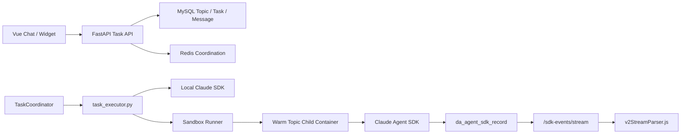
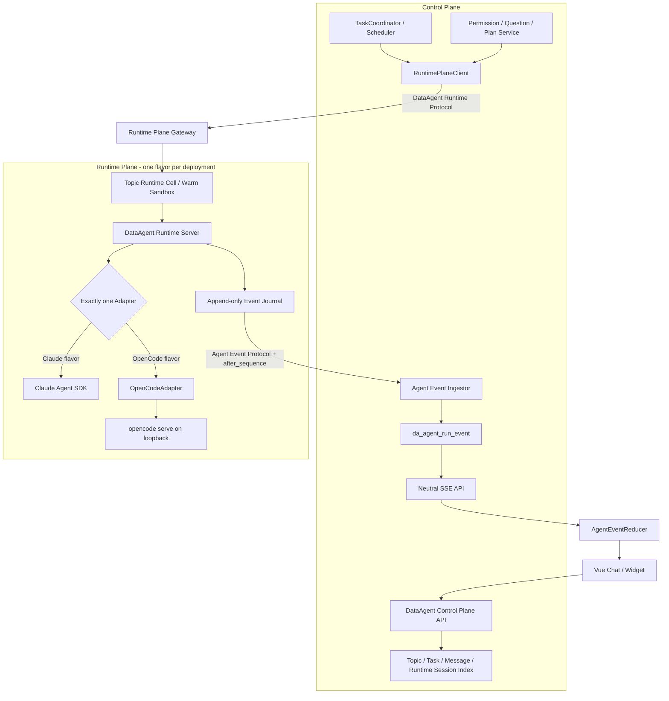
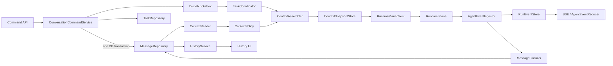
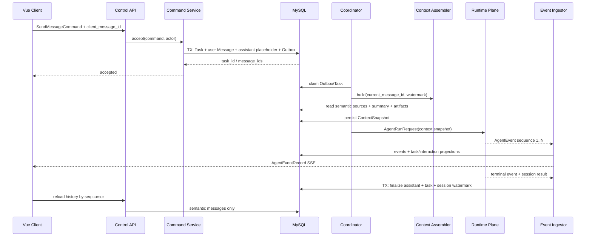

# DataAgent 控制面/Runtime 数据面与单激活 Adapter 设计

- Date: 2026-08-28
- Status: Proposed
- Goal: 在保留 DataAgent 现有异步任务、Sandbox、SSE、Skill 和 Portal MCP 业务能力的前提下，将产品控制面与 Agent 执行数据面分离；控制面只依赖 DataAgent Runtime Protocol，数据面可构建为 Claude Agent SDK 或 OpenCode 两种 flavor，一次部署只激活一种 Runtime，启动后不支持在线切换。
- Tech Stack: Python 3.11+、FastAPI、AnyIO、MySQL 8、Redis、Docker、Claude Agent SDK、OpenCode Server、HTTP/SSE、Vue 3
- Plan: [2026-08-28-dataagent-single-runtime-sdk-adapter-plan.md](../plans/2026-08-28-dataagent-single-runtime-sdk-adapter-plan.md)

## 1. 结论

方案可行，推荐采用“统一控制面 + 单激活 Runtime 数据面 + 双 Adapter flavor”，而不是在 Topic、Agent Profile 或每次请求上动态选择 SDK。

核心结论如下：

1. DataAgent 控制面只依赖版本化的 `DataAgent Runtime Protocol`；Claude 和 OpenCode 的 import、原生事件、Session、权限回调、MCP 配置和进程管理全部留在 Runtime 数据面。
2. `DATAAGENT_AGENT_RUNTIME=claude_agent_sdk|opencode` 只在进程启动时读取。Runtime 在应用生命周期内不可变，API 和管理页面不提供选择入口。
3. 控制面使用一套不含厂商 SDK 的通用镜像；Runtime 数据面分别构建 Claude/OpenCode 两种镜像 flavor。部署配置必须选择匹配的 Runtime 数据面镜像，启动时不匹配直接失败。
4. 现有 Sandbox Runner 演进为 Runtime Plane Gateway，继续管理 Topic warm child；每个 child 内运行统一的 DataAgent Runtime Server shell 和当前 flavor 的唯一 Adapter。
5. 控制面拥有 Task、权限、事件持久化和 Session 索引；数据面不直接读写 DataAgent 业务 MySQL，只通过可重放的中立事件协议回传执行结果。
6. 前端只解析版本化的 `DataAgent Agent Event Protocol`，不再解析 Anthropic/OpenCode 原生流；`chat_conversation_id` 不再承载厂商 Session ID。
7. OpenCode 不在控制面引入非官方 Python SDK，也不增加 Node 业务 Sidecar。OpenCode flavor 在 Runtime Cell 内管理固定版本的 `opencode serve`，由 Python Adapter 通过 `httpx + SSE` 调用其 loopback 接口。
8. OpenCode 的权限、Question 和 Plan 交互是主要技术卡点。必须针对选定的 OpenCode 版本锁定 OpenAPI/SSE 契约并跑真实交互测试；缺少可用 Question reply/Plan exit 契约时，OpenCode flavor 不得进入生产。
9. “消息”必须拆为命令、语义会话消息、执行事件、交互记录、模型上下文和厂商 Runtime 消息六种对象。`da_agent_message` 是会话事实，`da_agent_run_event` 是执行事实，`ContextSnapshot` 是某次运行的输入事实；三者不能互相代替。

这套设计实现的是“部署前可选、部署后固定”，不是在线双运行时，也不是故障时跨 SDK 自动降级。

## 2. 范围

### 2.1 包含

- Claude Agent SDK 与 OpenCode 两个 Runtime 适配器。
- DataAgent 控制面与 Runtime 数据面的服务边界和内部协议。
- 部署期 Runtime 选择、镜像 flavor 校验和数据库 Runtime 锁。
- 中立的执行请求、执行结果、事件、Session、工具身份、权限和用户交互契约。
- 消息提交、任务派发、会话消息持久化、历史查询、上下文读取/裁剪、上下文快照和前端投影边界。
- 现有 Chat、后台任务、定时任务、Follow-up Suggestion、模型检测和 Skill 比较执行入口的统一收口。
- OpenCode Server 的进程生命周期、健康检查、SSE、取消、Session 恢复、MCP 和 Skills 接入。
- 历史 Anthropic SDK 事件与旧 Session 字段的兼容和迁移路径。
- 分阶段灰度、验证和回退。

### 2.2 不包含

- 同一部署内按用户、Topic、Agent Profile 或请求动态选择 Runtime。
- 运行中热切换 Runtime。
- Claude 失败后自动改用 OpenCode，或反向自动降级。
- 把 Claude 原生 Session 直接交给 OpenCode 恢复，或反向操作。
- 本期接入 Qwen Code、Pi 等第三个 Runtime。
- 重写现有任务协调器、Redis Lease 或 Portal MCP；Sandbox Runner 只演进其内部协议和职责边界。
- 自研完整 Agent Loop。

## 3. 术语和不变量

| 术语 | 含义 |
| --- | --- |
| Control Plane | DataAgent API、TaskCoordinator、业务持久化、用户交互、事件投影和运维管理 |
| Runtime Plane | 运行 Agent Loop、Sandbox、工具、Skills、MCP 和厂商 Session 的执行数据面 |
| Runtime Gateway | 由现有 Sandbox Runner 演进的长驻入口，管理 Topic Runtime Cell 和 affinity |
| Runtime Cell | Topic 级 warm child，包含 workspace、HOME、短期事件 journal 和当前 Adapter |
| Runtime Protocol | 控制面与 Runtime 数据面之间的版本化请求、事件、交互和取消协议 |
| Runtime | 负责 Agent Loop、工具调用、流式事件和 Session 的底层实现 |
| Adapter | 把某个 Runtime 的接口翻译成 DataAgent 中立契约的模块 |
| Artifact flavor | 只包含某一种 Runtime 依赖的 Runtime Plane 镜像变体 |
| Model Provider | Anthropic、OpenRouter、AnyRouter 或兼容端点；与 Runtime 是两个维度 |
| Runtime Session | 某个 Topic 在底层 Runtime 中的外部 Session |
| Neutral Event | DataAgent 定义、前端和持久化共同使用的稳定事件 |
| Conversation Message | 用户和助手之间有长期语义价值、可用于历史展示或后续上下文的持久化消息 |
| Agent Event | 一次 run 内的内容增量、工具、交互、用量和终态等不可变执行事实 |
| Context Snapshot | 某次 run 实际采用的历史、摘要、Artifact 和配置指纹的版本化快照 |
| Runtime Message | Adapter 内部使用的 Claude/OpenCode 原生消息；不得越过 Runtime Plane 边界 |

以下是不允许被实现破坏的不变量：

- 一个 DataAgent 部署实例只有一个激活 Runtime。
- 任务执行期间不会改变 Runtime。
- Runtime 选择不来自用户输入、Topic、Agent Profile 或任务请求。
- 业务模块不得直接 import `claude_agent_sdk`，也不得直接依赖 OpenCode HTTP/SSE payload。
- 控制面不得安装厂商 SDK，不得直接访问 OpenCode Server，也不得执行厂商 Agent Loop。
- Runtime 数据面不得直接读写 DataAgent Topic、Task、Message 和 Event 业务表。
- 控制面只调用统一 Runtime Protocol；OpenCode 原生 Server 只是 OpenCode flavor 的内部实现。
- 前端不得识别 `AssistantMessage`、`ResultMessage` 或 OpenCode 的原生 Part/Event 类型。
- 外部 Session ID 必须与 `runtime_kind` 一起校验后才能恢复。
- 历史消息读取和模型上下文读取必须使用不同的查询接口与筛选策略。
- 原生 Runtime Session 只能作为加速和连续执行机制，不能成为会话历史的唯一事实来源。
- 当前用户输入在一次 run 中必须恰好出现一次；Session resume 和历史重放不能同时注入同一段上下文。
- 跨 Runtime 切换只能通过停机发布和显式迁移完成，不能由重试逻辑触发。

## 4. Current State

当前执行主链已经具备可复用的任务、持久化和隔离基础：



主要耦合点如下：

| 耦合面 | 当前位置 | 问题 |
| --- | --- | --- |
| SDK 创建与执行 | `core/task_executor.py` | 直接构造 Claude options、消费 Claude message types |
| 通用运行时辅助 | `core/agent_runtime.py` | Provider、MCP、工具名、Claude Session 路径和 workspace guard 混在一个模块 |
| 流事件持久化 | `core/sdk_block_writer.py` | 通过 Python 类名识别 `StreamEvent`、`AssistantMessage`、`UserMessage`、`ResultMessage` |
| 前端实时渲染 | `v2StreamParser.js` | 明确解析 Anthropic 原生 block event |
| Session | `da_agent_topic.chat_conversation_id` | 一个无类型字符串承担 Claude Session ID，不具备异构保护 |
| 权限与交互 | `core/permission_gate.py`、`task_executor.py` | `AskUserQuestion`、`ExitPlanMode`、`PermissionUpdate` 和 Claude 工具名进入业务逻辑 |
| Skills workspace | `prepare_topic_workspace` | 路径和目录名偏 Claude，但 OpenCode 可读取 `.claude/skills`，内容本身可复用 |
| 辅助 Agent 调用 | `followup_suggestions.py`、`skill_admin_service.py` | 绕过主任务执行抽象直接调用 Claude SDK |
| 部署依赖 | `requirements.txt`、backend/runner Dockerfile | 固定安装 `claude-agent-sdk`，没有 Runtime flavor 和能力清单 |
| 消息提交 | `task_submission_service.py` | Task、用户消息、助手占位消息和 Redis 派发分多次提交，缺少统一幂等键和 transactional outbox |
| 历史读取 | `TopicTaskStore.list_topic_messages*` | 以 `show_in_ui=1` 同时服务 UI 历史和模型上下文，并在列表查询中读取 SDK 原始记录补 blocks |
| 上下文组装 | `TaskCoordinator._build_history`、`agent_runtime._build_prompt` | 将全部可见消息拼成 `[用户]/[助手]` 文本；无 token budget、watermark、摘要、来源和版本记录 |
| 交互存储 | `TopicTaskStore` permission/question 方法 | pending/resolved 状态从 `da_agent_sdk_record` 反向扫描，业务交互依赖厂商兼容事件表 |

现有 `TaskCoordinator`、Redis Lease、Sandbox Runner、warm topic container、MySQL 事件持久化及 SSE 重连机制不依赖 Claude 的核心职责应继续保留。

## 5. Problem

### 5.1 执行耦合不是一个 import 问题

只增加一个 `if runtime == "opencode"` 无法解除锁定。当前厂商语义已经进入请求参数、工具名、权限决策、事件表、历史投影、前端解析和 Session 字段。若只封装 `query()`，其余层仍会锁定在 Anthropic 协议上。

### 5.2 OpenCode 的接入模型不同

Claude Agent SDK 是 Python 库和子进程式执行接口；OpenCode 对 Python 最稳定的可编程边界是 headless HTTP Server。OpenCode 提供 Session、异步 prompt、abort、SSE、permission 和 MCP 接口，但其 JS/TS SDK 和新一代嵌入式 SDK 仍在演进。直接把 Node SDK 嵌入 Python 主服务会增加第二套应用运行时和跨语言生命周期问题。

### 5.3 原生事件不能作为 DataAgent 公共协议

当前 UI 和历史消息投影建立在 Anthropic block 顺序与 payload 上。OpenCode 使用 message/part/event 模型。若前端同时理解两套原生协议，以后接入第三个 Runtime 时还会继续复制分支。

### 5.4 Session 不能跨 Runtime 恢复

Claude 和 OpenCode 的 Session ID、磁盘状态、压缩策略和恢复语义不同。即使字符串格式碰巧兼容，也不能互相传递。需要独立存储外部 Session 和来源 Runtime，并在恢复前校验。

### 5.5 权限和 Plan 是最大能力差异

Claude 可在 `can_use_tool` 回调中允许、拒绝或重写输入，并通过 `AskUserQuestion`、`ExitPlanMode` 等工具表达交互。OpenCode 通过 SSE 发布 permission/question 事件，再调用 HTTP reply 接口恢复执行；Plan 退出还依赖其 Agent/Question 流程。当前把 `title`、`summary` 混入 Portal MCP 参数再由 Claude 回调剥离的做法，不能可靠迁移到一个只接受 allow/reject 的 Runtime。

### 5.6 当前执行子进程直接写业务库，控制面/数据面边界不完整

当前 child 通过 `SdkBlockWriter` 直接写 `da_agent_sdk_record`。这保证了早期流式可观测性，但意味着执行容器必须持有业务 MySQL 凭据，并把厂商事件格式直接写进控制面数据库。拆分后应由 Runtime Cell 保留短期、可按 sequence 重放的 event journal，控制面负责消费、校验和幂等持久化。数据面不再拥有业务表写权限。

### 5.7 当前“消息”同时承担五种职责

当前 `da_agent_message` 既是 UI 历史，又是上下文来源，助手行还是任务状态占位；历史列表再从 `da_agent_sdk_record` 补齐 tool/interaction blocks。权限和问题回复也直接写入同一 SDK 记录表。这会产生三类问题：展示策略会意外改变模型输入；事件表结构会锁定业务交互；历史列表需要为每批消息加载执行明细。

消息提交也不是一个原子业务动作。`submit_message_task()` 依次创建 Task、用户消息、助手占位消息，再派发 Coordinator；任一步失败都可能留下局部状态。网络重试若没有 `client_message_id`，还可能产生重复用户消息和重复工具执行。

### 5.8 原生 Session 和手工历史存在两套上下文语义

当前有可恢复 Session 时只发送本轮问题；没有 Session 时，`TaskCoordinator._build_history()` 读取全部 UI 可见消息，`_build_prompt()` 再把它们拼成单个文本 prompt。这意味着同一个 Topic 在 Session 正常、Session 丢失或切换 Runtime 后，模型接收到的角色、工具结果、摘要和边界并不相同，也无法回答“某次执行究竟读取了哪些上下文”。必须把 Context 读取、选择、组装、快照和 Adapter 渲染定义为独立子系统。

## 6. Design

### 6.1 总体架构



控制面只认识 `DataAgent Runtime Protocol`，不直接认识 Claude/OpenCode。Runtime Gateway 对控制面暴露一个稳定协议，并把 run 路由到 Topic affinity 对应的 warm Runtime Cell。Runtime Cell 的 server shell 在启动时只创建当前镜像 flavor 的一个 Adapter；请求结构中没有 `runtime_kind` 选择字段。

OpenCode 官方 Server 位于 OpenCode Runtime Cell 内部，不直接暴露给控制面。Claude flavor 也不是另造一套公共 API，而是由同一个 DataAgent Runtime Server shell 包装 Claude Agent SDK。这样控制面永远只维护一套 Session、事件、取消和交互客户端。

### 6.2 模块边界

控制面建议把当前 `core/agent_runtime.py` 拆成 Runtime Protocol client package：

```text
core/agent_runtime/
  __init__.py
  contracts.py
  capabilities.py
  bootstrap.py
  client.py
  session_store.py
  event_ingestor.py
  interaction_service.py
  tool_policy.py
  tool_identity.py
  model_config.py
```

会话、消息和上下文不放入 Runtime package，单独建立控制面领域模块：

```text
core/conversation/
  contracts.py
  command_service.py
  message_repository.py
  message_finalizer.py
  history_service.py
  interaction_repository.py
  dispatch_outbox.py
  context_reader.py
  context_policy.py
  context_assembler.py
  context_snapshot_store.py
  session_resume_policy.py
```

Runtime 数据面新增统一 server shell：

```text
runtime_plane/
  app.py
  api.py
  contracts.py
  manifest.py
  supervisor.py
  event_journal.py
  interaction_waiter.py
  workspace.py
  policy_enforcer.py
  adapters/
    claude_agent_sdk.py
    opencode.py
  transports/
    opencode_server.py
```

依赖规则：

- 只有 Runtime Plane 的 `adapters/claude_agent_sdk.py` 可以 import `claude_agent_sdk`。
- 只有 Runtime Plane 的 `adapters/opencode.py` 和 `transports/opencode_server.py` 可以认识 OpenCode endpoint 和 event payload。
- `TaskCoordinator`、API、Store、Agent Profile、Follow-up、Skill Admin 和前端只认识共享 Runtime/Event contracts。
- API route 只做 HTTP schema、认证和错误映射；`ConversationCommandService` 独占“创建 Task + 用户消息 + 助手消息 + dispatch outbox”的事务边界。
- `ConversationHistoryService` 只读取长期语义消息；`ContextAssembler` 通过 `ContextReader` 读取带 watermark 的上下文候选，不能调用 UI history API。
- `MessageFinalizer` 从中立事件投影最终助手消息；实时执行 block 始终从 `AgentEvent` 投影，不能回写成厂商 block JSON。
- 控制面拥有用户权限决策和业务状态；Runtime Plane 使用随 run 下发的不可变 `ExecutionPolicySnapshot` 做 fail-closed 执行校验。
- workspace escape、工具 schema 校验和 secret redaction 必须在 Runtime Plane 执行边界再次强制执行。
- `task_executor.py` 的厂商执行部分迁入 Runtime Plane；控制面只保留 dispatch、timeout、recovery 和 result persistence。
- Runtime Plane 不获得 DataAgent 业务 MySQL 凭据；事件通过 journal/API 回传，由控制面写库。

### 6.3 核心接口

共享执行请求仍使用 Pydantic/dataclass，但控制面调用的是网络化 Runtime Protocol，而不是进程内 Adapter：

```python
@dataclass(frozen=True)
class AgentRunRequest:
    run_id: str
    task_id: str | None
    topic_id: str | None
    purpose: Literal["chat", "followup", "skill_compare", "model_probe"]
    context: ContextBundle
    model: ModelTarget
    session: RuntimeSessionRef | None
    workspace: WorkspaceSpec
    skills: list[SkillSpec]
    mcp_servers: list[McpServerSpec]
    policy: ExecutionPolicySnapshot
    limits: RunLimits

@dataclass(frozen=True)
class ContextBundle:
    snapshot_id: str
    policy_version: str
    history_through_seq: int
    system_fragments: list[ContextFragment]
    conversation: list[NeutralMessage]
    current_input: NeutralMessage
    memory: ContextMemory
    artifacts: list[ContextArtifact]
    provenance: list[ContextProvenance]
    budget: ContextBudgetResult

class RuntimePlaneClient(Protocol):
    async def start_run(self, request: AgentRunRequest) -> RunAccepted: ...
    async def stream_events(self, run_id: str, after_sequence: int) -> AsyncIterator[AgentEvent]: ...
    async def get_run(self, run_id: str) -> RunStatus: ...
    async def resolve_interaction(self, run_id: str, decision: InteractionDecision) -> None: ...
    async def cancel_run(self, run_id: str, reason: str) -> None: ...
    async def get_manifest(self) -> RuntimeManifest: ...

class AgentRuntimeAdapter(Protocol):
    kind: RuntimeKind
    capabilities: RuntimeCapabilities

    async def validate_installation(self) -> RuntimeManifest: ...
    async def execute(
        self,
        request: AgentRunRequest,
        event_sink: RuntimeEventJournal,
        interaction_waiter: RuntimeInteractionWaiter,
        cancel_token: CancelToken,
    ) -> AgentRunResult: ...
    async def close(self) -> None: ...
```

Runtime Plane 对控制面提供：

```http
GET  /v1/runtime/manifest
GET  /v1/runtime/health
POST /v1/runs
GET  /v1/runs/{run_id}
GET  /v1/runs/{run_id}/events?after_sequence=100
POST /v1/runs/{run_id}/cancel
POST /v1/runs/{run_id}/interactions/{interaction_id}/resolve
```

`POST /v1/runs` 必须带由控制面生成的 `run_id` 和 `idempotency_key=task_attempt_id`。重复提交返回同一个 run，不得重复执行工具。

`AgentRunRequest` 故意没有“选择哪个 Runtime”的字段。`RuntimeSessionRef` 包含 `runtime_kind` 仅用于一致性校验；与当前部署不一致时 fail closed。Provider secret 通过受认证连接以短生命周期 execution secret envelope 下发，不进入 request log、event journal 或 Session metadata。

### 6.4 能力契约

`RuntimeCapabilities` 不是给业务层做静默降级，而是启动、健康检查和发布门禁使用：

| 能力 | Claude | OpenCode | 生产要求 |
| --- | --- | --- | --- |
| 文本/Thinking 流 | partial messages | SSE part/message events | 必须 |
| Session 恢复 | `resume=session_id` | OpenCode Session ID | 必须 |
| 取消 | AnyIO/SDK 取消 | `POST /session/:id/abort` | 必须 |
| Remote MCP | SDK HTTP MCP config | OpenCode remote MCP config/API | 必须 |
| Skills | `.claude/skills` | 兼容读取 `.claude/skills` | 必须 |
| 工具权限 | `can_use_tool` | permission event + reply | 必须 |
| 用户问题 | `AskUserQuestion` | question event + reply | 必须 |
| Plan 审批 | `ExitPlanMode`/mode update | plan exit + question flow | 使用 Plan 模式时必须 |
| Workspace 防逃逸 | PreToolUse hook + Sandbox | OpenCode permission + Sandbox | 必须 |

如果所选版本不满足“必须”能力，`validate_installation()` 或集成契约测试失败，不允许通过自动批准、忽略事件或关闭功能来伪装兼容。

### 6.5 启动选择与不可变 Runtime

新增配置：

```dotenv
DATAAGENT_AGENT_RUNTIME=claude_agent_sdk
```

Runtime Protocol 和 Agent Event Protocol 版本由 Control Plane/Runtime Plane 构建产物 manifest 声明并在启动时协商，不作为部署人员可随意修改的环境变量。

OpenCode flavor 额外使用：

```dotenv
DATAAGENT_OPENCODE_BINARY=/usr/local/bin/opencode
DATAAGENT_OPENCODE_STARTUP_TIMEOUT_SECONDS=15
DATAAGENT_OPENCODE_SHUTDOWN_GRACE_SECONDS=5
```

启动顺序：

1. 读取 `DATAAGENT_AGENT_RUNTIME`，只接受两个显式枚举值。
2. Runtime Plane 读取镜像内 `/opt/dataagent-runtime/runtime-manifest.json`，构造唯一 Adapter 并校验 flavor、依赖版本、二进制和能力。
3. 控制面调用 Runtime Gateway `/v1/runtime/manifest`，校验配置的 Runtime、Runtime Protocol、Agent Event Protocol 和工具目录指纹。
4. Runtime Gateway 抽查/预热一个 Runtime Cell，确认 Cell manifest 与 Gateway 一致。
5. 通过数据库 Runtime 锁确认本环境没有被另一 Runtime 初始化。
6. 全部成功后才启动 TaskCoordinator；任一步失败均阻止 readiness。

数据库新增单行锁表：

```text
da_agent_runtime_deployment
  deployment_key               VARCHAR(64) PK   -- 固定 primary
  runtime_kind                 VARCHAR(32)
  runtime_protocol_version     VARCHAR(64)
  agent_event_protocol_version VARCHAR(64)
  initialized_at               DATETIME(3)
  updated_at                   DATETIME(3)
```

首次启动原子写入；后续启动只允许相同 `runtime_kind`。改变环境变量不会改变锁。需要跨 Runtime 迁移时必须停机执行独立命令，不能靠删除记录绕过。

### 6.6 发布物和依赖

控制面只构建一个通用镜像，不包含 Claude Agent SDK 或 OpenCode binary。Runtime Plane 构建两个 flavor：

| 发布物 | Python/二进制依赖 | 建议镜像 |
| --- | --- | --- |
| Control Plane | FastAPI、MySQL/Redis client、Runtime Protocol client；无厂商 SDK | `dataagent-control-plane:<version>` |
| Claude Runtime Plane | Runtime Server shell、`claude-agent-sdk==0.2.115` 及其所需 CLI | `dataagent-runtime-plane:<version>-claude` |
| OpenCode Runtime Plane | Runtime Server shell、`httpx`、固定版本 OpenCode standalone binary | `dataagent-runtime-plane:<version>-opencode` |

Runtime Plane 镜像同时作为长驻 Gateway/Runner 和 Topic child 的基础镜像，使用不同 entrypoint。开发环境可额外提供包含两者的 `runtime-plane:dev` 镜像，但生产 compose 不使用 universal Runtime image，以减少体积、依赖漏洞和误配置面。

依赖拆分为：

```text
requirements-control-plane.txt
requirements-runtime-common.txt
requirements-runtime-claude.txt
requirements-runtime-opencode.txt
```

OpenCode flavor 的 Python 侧继续使用 `httpx` 和受控 SSE parser；不引入非官方 Python SDK，也不要求控制面使用 OpenCode npm SDK。OpenCode binary 本身在镜像构建期固定版本并执行 `opencode --version` 验证。

### 6.7 Claude 适配器

Claude 适配器从现有实现迁入 Runtime Plane，保持当前行为：

- 把 `AgentRunRequest` 映射为 `ClaudeAgentOptions`。
- 通过 `query()` 消费消息，统一映射到 Agent Event 并追加到 Runtime Cell journal。
- `RuntimeSessionRef.external_session_id` 映射到 `resume`。
- 把 `McpServerSpec(streamable_http)` 映射为 Claude SDK 的 HTTP MCP 配置。
- 把 Claude tool name 映射为 Canonical Tool ID，再交给 Runtime Plane policy enforcer；其规则来自控制面下发的不可变 snapshot。
- `can_use_tool` 中只负责发出中立 interaction event、等待控制面回复，再把 `InteractionDecision` 翻译成 Claude allow/deny/update 结果。
- PreToolUse workspace hook 作为 Sandbox 之外的纵深防御保留。
- SDK 专属的 Session 文件定位、partial-message 兼容和 slash command discovery 不得泄漏到通用层。

第一阶段先把现有行为原样搬入适配器，用 Claude 作为基线证明抽象没有改变用户行为。

### 6.8 OpenCode 适配器

#### 6.8.1 接入方式

OpenCode 采用“Python client + 受管 loopback server”：

1. `OpenCodeProcessManager` 在 Topic Runtime Cell 内启动固定版本 `opencode serve`。
2. 绑定 `127.0.0.1` 随机空闲端口，不对容器网络暴露。
3. 每次启动生成随机 `OPENCODE_SERVER_PASSWORD`，Python 使用 HTTP Basic Auth。
4. 调用 health endpoint 取得版本，版本不在 allowlist 时拒绝执行。
5. 创建或恢复 OpenCode Session，发送 async prompt，同时订阅 SSE。
6. 把 message/part/tool/permission/question/session 状态映射为 Neutral Event。
7. 取消时先调用 session abort；超过 grace period 仍未结束则终止 server/child container。

不增加全局共享 OpenCode 服务。每个 warm topic child 维护自己的 OpenCode 进程、HOME 和 workspace，可以延续现有 Topic 级隔离与 warm reuse。

#### 6.8.2 Session 和持久目录

- OpenCode Server 以 `/mnt/workspace` 为工作目录。
- OpenCode HOME/XDG 数据位于该 Topic 的 `/mnt/home`，随现有 host runtime 目录持久化。
- Python 主库仍是任务、消息和 UI 历史的权威来源；OpenCode 本地数据库只用于底层 Session 恢复。
- warm child 退出后，下次启动同一 Topic 可以从 `/mnt/home` 恢复；若恢复失败，Session 标为 `invalid`，由明确的同 Runtime 重建流程回放中立历史，不能静默创建一个上下文不一致的 Session。

#### 6.8.3 MCP、Skills 和 Provider

- `McpServerSpec` 使用中立 transport：`streamable_http`、`sse`、`stdio`。
- OpenCode 适配器把 Portal MCP 映射为 remote MCP；Claude 适配器映射为 SDK HTTP MCP。
- 当前 Skill bundle 继续作为唯一事实来源。OpenCode 已兼容 `.claude/skills`，因此部署路径可以暂时保持 `/app/.claude/skills`，但通用代码只使用 `skills_root`，不能硬编码厂商目录。
- `ModelTarget` 保留 `provider_id`、`model_name`、`base_url`、credential reference 和 options。Claude/OpenCode 分别负责生成环境变量或临时配置。
- 密钥只在任务启动时解析到进程环境或权限受限的临时配置，不能进入 Agent Profile snapshot、Runtime Session metadata、事件或日志。

#### 6.8.4 OpenCode 的强制契约门禁

OpenCode 版本演进较快，以下接口不能只靠文档推断：

- SSE event type、顺序、重连和终止条件。
- permission asked/replied payload 与 `once`、`always`、`reject` 语义。
- question asked/reply/reject 的公开 endpoint。
- `plan_exit` 触发 Question 后恢复到 build agent 的完整状态变化。
- remote MCP 工具命名规则和错误事件。

实现前先选定版本并保存其 OpenAPI/事件 fixture；CI 运行真实 Server contract test。Question/Plan reply 如果在该版本没有稳定公开接口，OpenCode 适配器状态保持 `experimental`，不能进入生产。禁止读取 OpenCode 内部 SQLite、模拟 SSE 或自动批准来绕过。

### 6.9 中立工具和权限模型

Agent Profile 当前的 `Read`、`Bash`、`Skill` 等名称是 Claude 工具名。改为 Canonical Tool ID，例如：

```text
workspace.read
workspace.search
workspace.write
shell.execute
skill.invoke
mcp:portal:<tool_name>
```

`ToolIdentityMapper` 负责厂商工具名与 Canonical Tool ID 双向映射。Agent Profile 只保存 Canonical Tool ID；迁移脚本把旧名称映射到中立名称。

控制面根据 Agent Profile、用户、Topic 和 data scope 生成不可变 `ExecutionPolicySnapshot`，随 run 下发；Runtime Plane 的 `PolicyEnforcer` 在每次工具调用前执行 snapshot。统一输入为：

```text
ToolCallContext
  task/topic/user
  canonical_tool_id
  normalized_input
  permission_mode
  workspace policy
  agent data scope
```

输出统一为 `allow | deny | ask_user`。`allow/deny` 可以在数据面立即执行；`ask_user` 生成 `interaction.requested` 事件并暂停 Runtime，控制面完成持久化和用户决策后调用 Runtime interaction resolve endpoint。适配器只负责把最终结果翻译成 Claude callback response 或 OpenCode permission reply。

当前把 `title`、`summary` 放进 Portal MCP 参数、等权限回调再剥离的做法必须移除。权限卡片标题和摘要由工具目录、Canonical Tool ID、参数预览和 diff 生成，不修改真实工具输入。这样既避免 Portal MCP schema 失败，也不依赖某个 SDK支持 input rewrite。

### 6.10 用户问题和 Plan 交互

保留现有 DataAgent API：

- `POST /tasks/{task_id}/permission-decision`
- `POST /tasks/{task_id}/question-answer`
- `POST /tasks/{task_id}/cancel`

Runtime Plane 的 `InteractionWaiter` 把 Runtime 原生请求转换为：

```text
InteractionRequest
  interaction_id
  task_id
  type: permission | question | plan_approval
  title
  description
  payload
  expires_at
```

该请求先作为标准 `interaction.requested` 进入 event journal；控制面的 `InteractionService` 消费后更新数据库 waiting 状态并通知前端。用户响应后，控制面调用：

```http
POST /v1/runs/{run_id}/interactions/{interaction_id}/resolve
```

Runtime Plane 追加 `interaction.resolved` 后恢复 Adapter。现有数据库 waiting 状态、超时和用户 API 继续复用。Claude 适配器处理 `AskUserQuestion`、`ExitPlanMode` 和 permission callback；OpenCode 适配器处理 question/permission SSE 和对应 reply。前端看不到原生事件。

Plan mode 必须经过专项 E2E 验证。OpenCode 不能完成“提出计划 -> 用户批准 -> 切到 build -> 继续同一任务”时，不允许声称与 Claude 等价；可以先关闭 OpenCode flavor 的 Plan 能力，但该 flavor 只能作为非生产实验版本。

### 6.11 中立事件协议

统一事件不能只是事件名约定和一个无约束的 `payload: {}`。它必须是 DataAgent 自己拥有、版本化、可校验的公共协议，正式命名为 **DataAgent Agent Event Protocol v1**。

该协议同时服务三个边界：

1. Runtime 数据面向控制面输出标准事件。
2. 控制面把标准事件持久化并通过 SSE 重放。
3. 前端把标准事件投影为 Chat/Widget 视图状态。

三层模型必须显式分开：

```text
AgentEvent                 -- 领域事件，控制面和 Runtime 共同理解
AgentEventRecord           -- 持久化/SSE 传输记录，增加 cursor
AgentViewState             -- 前端投影，不属于线协议
```

禁止把数据库自增 ID 塞入领域事件，也禁止把前端 block 结构反向当作 Runtime 协议。

#### 6.11.1 事实来源和版本规则

语言无关 JSON Schema 是 wire contract 的唯一事实来源：

```text
dataagent/contracts/agent-events/v1/
  agent-event.schema.json
  agent-event-record.schema.json
  README.md
  examples/
    run-started.json
    content-stream.json
    tool-call.json
    permission.json
    question.json
    plan-approval.json
    run-completed.json
    run-failed.json
```

Python 和 TypeScript 模型是该 schema 的实现：

```text
dataagent/dataagent-backend/core/agent_events/models.py
dataagent/dataagent-frontend/src/contracts/agentEvents.v1.ts
```

- `spec_version` 使用 `dataagent.agent-event/1.0`。
- 所有 object 默认 `additionalProperties: false`；扩展必须先进入 schema，不能依赖透传字段。
- Runtime manifest 必须声明支持的 event protocol 版本。
- 控制面只接受明确支持的版本；不支持的 major/minor 直接返回 `runtime_protocol_version_unsupported`。
- 前端只接收已经被控制面 schema 校验过的事件。
- 增加可选字段可以发布兼容的小版本；增加或改变必需字段、事件状态语义必须升级协议版本。
- 不允许 Runtime Adapter 发送“先落库再由前端猜测”的未知事件。

#### 6.11.2 AgentEvent 基础信封

所有事件共享以下强类型信封：

```json
{
  "spec_version": "dataagent.agent-event/1.0",
  "run_id": "run_xxx",
  "task_id": "task_xxx",
  "topic_id": "topic_xxx",
  "sequence": 7,
  "occurred_at": "2026-08-28T10:00:00.000Z",
  "source": {
    "runtime_kind": "opencode",
    "runtime_version": "<pinned-version>",
    "adapter_version": "1"
  },
  "type": "tool.started",
  "data": {}
}
```

字段定义：

| 字段 | 类型 | 约束 |
| --- | --- | --- |
| `spec_version` | string literal | 必须是协商后的确切协议版本 |
| `run_id` | string | 一次 Agent 执行 attempt 的稳定 ID；重试或恢复创建新 run 时使用新 ID |
| `task_id` | string | DataAgent Task ID，由控制面生成 |
| `topic_id` | string | Topic affinity 和审计标识 |
| `sequence` | integer | 同一 `run_id` 从 1 开始严格递增，由 Runtime Server 在归一化后分配 |
| `occurred_at` | RFC 3339 timestamp | 仅用于展示和耗时分析，不能用于事件排序 |
| `source` | object | Runtime 审计信息，不参与前端业务分支 |
| `type` | enum discriminator | 决定 `data` 的确切 schema |
| `data` | discriminated union | 不允许无定义的自由 payload |

`AgentEvent` 不包含数据库 `id`、SSE cursor、Provider credential、外部 Runtime Session ID 或厂商原始消息。

一个 Task 可以因 recovery/retry 包含多个 run；每个 run 独立从 sequence 1 开始，Task 事件 API 按数据库 cursor 串联多个 run，不能让新 attempt 复用旧 run 的 sequence 空间。

#### 6.11.3 显式事件联合类型

协议 v1 定义如下 discriminated union：

```text
AgentEventData =
    RunStartedData
  | TurnStartedData
  | ContentStartedData
  | ContentDeltaData
  | ContentCompletedData
  | ToolStartedData
  | ToolProgressData
  | ToolCompletedData
  | InteractionRequestedData
  | InteractionResolvedData
  | UsageUpdatedData
  | RunCompletedData
  | RunSuspendedData
  | RunFailedData
  | RunCancelledData
```

每种类型的必需字段如下。

##### `run.started`

```json
{
  "type": "run.started",
  "data": {
    "purpose": "chat",
    "model": {
      "provider_id": "openrouter",
      "model_name": "anthropic/claude-sonnet-4"
    },
    "resume_mode": "new",
    "trigger": "user"
  }
}
```

- `purpose`: `chat | followup | skill_compare | model_probe`。
- `resume_mode`: `new | resumed | rebuilt`。
- `trigger`: `user | schedule | retry | recovery`。
- 只能出现一次，且必须是一个 run 的第一条事件。

##### `turn.started`

```json
{
  "type": "turn.started",
  "data": {
    "turn_id": "turn_1",
    "turn_index": 0
  }
}
```

`turn_id` 是其他 content/tool 事件的关联键；不能使用厂商 message ID 作为公共 ID。

##### `content.started`、`content.delta`、`content.completed`

```json
{
  "type": "content.started",
  "data": {
    "content_id": "content_1",
    "turn_id": "turn_1",
    "channel": "text",
    "order": 0
  }
}
```

```json
{
  "type": "content.delta",
  "data": {
    "content_id": "content_1",
    "delta_index": 0,
    "text": "查询结果"
  }
}
```

```json
{
  "type": "content.completed",
  "data": {
    "content_id": "content_1",
    "finish_reason": "complete"
  }
}
```

- `channel`: `text | thinking`。
- `delta_index` 在同一 content 内从 0 严格递增。
- `finish_reason`: `complete | truncated | cancelled | error`。
- 每个 delta 必须位于对应 started 和 completed 之间。
- Signature、redacted thinking 等厂商结构必须在 Adapter 内处理，不能新增 Anthropic 专属 channel。

##### `tool.started`

```json
{
  "type": "tool.started",
  "data": {
    "tool_call_id": "call_1",
    "turn_id": "turn_1",
    "tool_id": "mcp:portal:run_sql",
    "display_name": "执行 SQL",
    "input": {
      "sql": "SELECT ..."
    },
    "redacted_paths": [],
    "risk_level": "low"
  }
}
```

- `tool_id` 必须是 Canonical Tool ID，不能是 `mcp__portal__run_sql` 等厂商名称。
- `input` 是完成 schema 校验和脱敏后的 JSON object；不持久化流式半成品 JSON。
- `risk_level`: `low | medium | high | critical`。
- `redacted_paths` 明确指出已经替换的敏感字段。

##### `tool.progress`

```json
{
  "type": "tool.progress",
  "data": {
    "tool_call_id": "call_1",
    "message": "正在执行查询",
    "completed_units": null,
    "total_units": null
  }
}
```

进度数字不适用时显式为 `null`，不能用缺失字段表达多个含义。

##### `tool.completed`

```json
{
  "type": "tool.completed",
  "data": {
    "tool_call_id": "call_1",
    "status": "success",
    "result": {
      "content_type": "json",
      "summary": "返回 30 行",
      "data": {"row_count": 30}
    },
    "error": null,
    "duration_ms": 842
  }
}
```

- `status`: `success | error | denied | cancelled`。
- `result` 是由 `content_type` 判别的联合类型：

```text
EmptyToolResult
  content_type = empty
  summary: string
  data: null

TextToolResult
  content_type = text
  summary: string
  data { text: string }

JsonToolResult
  content_type = json
  summary: string
  data: JsonValue

TableToolResult
  content_type = table
  summary: string
  data {
    columns[] { key, label, data_type }
    preview_rows: JsonObject[]
    row_count: integer
    truncated: boolean
  }

ArtifactToolResult
  content_type = artifact
  summary: string
  data { artifact_id, name, mime_type, size_bytes }
```

- `input` 虽是任意工具的 JSON object，但必须通过该 Canonical Tool 在 Tool Catalog 中登记的 input schema；它不是无约束透传字段。
- `error` 使用下文统一 `AgentError`，成功时必须为 `null`。
- `preview_rows` 和 text/json data 都有协议级字节/行数上限；大结果、文件和完整表格使用 artifact reference，不能把无上限结果塞进事件。

##### `interaction.requested`

```json
{
  "type": "interaction.requested",
  "data": {
    "interaction_id": "interaction_1",
    "kind": "permission",
    "tool_call_id": "call_1",
    "title": "执行高风险操作",
    "description": "需要确认后继续",
    "expires_at": "2026-08-28T10:10:00.000Z",
    "request": {
      "tool_id": "shell.execute",
      "input_summary": "执行发布命令",
      "risk_level": "high",
      "allowed_decisions": ["allow_once", "deny"]
    }
  }
}
```

父级 `kind` 同时决定 `request` 的确切联合类型：

```text
PermissionRequest
  kind = permission
  tool_id, input_summary, risk_level, allowed_decisions

QuestionRequest
  kind = question
  questions[] {
    question_id: string
    header: string
    prompt: string
    options[] { option_id, label, description }
    multiple: boolean
    min_selections: integer
    max_selections: integer | null
  }

PlanApprovalRequest
  kind = plan_approval
  plan_summary, artifact_ref, allowed_decisions
```

`kind` 只允许 `permission | question | plan_approval`。`tool_call_id` 对 permission 通常是 string，对独立 question/plan 可以为 `null`。厂商 tool input 不直接成为 UI 卡片模型。

##### `interaction.resolved`

```json
{
  "type": "interaction.resolved",
  "data": {
    "interaction_id": "interaction_1",
    "kind": "permission",
    "outcome": "allow_once",
    "answers": null,
    "resolved_by": "user",
    "resolved_at": "2026-08-28T10:02:00.000Z"
  }
}
```

- `outcome`: `allow_once | allow_always | deny | answered | approved | rejected | expired | cancelled`。
- `answers` 只在 Question answered 时为 `{question_id: [option_id_or_free_text, ...]}`，其他情况必须为 `null`；选择数量必须符合对应 question 的 min/max。
- `resolved_by`: `user | policy | timeout | system`。

##### `usage.updated`

```json
{
  "type": "usage.updated",
  "data": {
    "aggregation": "cumulative",
    "input_tokens": 1200,
    "output_tokens": 380,
    "cache_read_tokens": null,
    "cache_write_tokens": null,
    "estimated_cost": null,
    "currency": null,
    "duration_ms": 5200
  }
}
```

- v1 统一采用 cumulative 语义，Reducer 不能把它再次累加。
- Runtime 不提供的值显式为 `null`。
- 金额使用 decimal string，不能使用浮点数。

##### Terminal events

一个 run 必须且只能产生一个 terminal event：

```text
run.completed
  finish_reason: complete | max_turns | stop
  final_content_id: string | null

run.suspended
  reason: interaction_detached | background_handoff | external_wait
  resume_token_ref: string | null

run.failed
  error: AgentError

run.cancelled
  reason: user | timeout | shutdown | lease_lost
  cancelled_by: user | system
```

`run.suspended` 表示当前 run 已结束、后续以新 run 继续；普通 permission/question 等待期间 run 仍然存活，不能提前发 suspended。

控制面状态投影固定为：

| 事件 | Task/Run 投影 |
| --- | --- |
| `run.started` | `running` |
| `interaction.requested` | `waiting_permission` 或 `waiting_input`，由 `kind` 决定 |
| `interaction.resolved` | 回到 `running`，除非同时收到 terminal event |
| `run.completed` | `success` |
| `run.suspended` | `suspended` |
| `run.failed` | `failed` |
| `run.cancelled` | `cancelled` |

Adapter 不允许直接更新 Task 状态；控制面只能依据通过验证的 AgentEvent 和 coordinator lifecycle 更新业务表。

统一错误模型：

```json
{
  "code": "provider_auth_failed",
  "message": "模型服务鉴权失败",
  "phase": "model_call",
  "retryable": false,
  "debug_ref": "trace_xxx"
}
```

`phase`: `bootstrap | model_call | tool_call | interaction | persistence | shutdown`。`message` 必须可安全展示，不得包含 API key、token、完整 SQL结果或厂商堆栈。

#### 6.11.4 大小、脱敏和 Artifact 约束

协议 v1 设置硬上限，防止模型或工具结果撑爆 MySQL/SSE/浏览器：

| 对象 | 上限 | 超限处理 |
| --- | --- | --- |
| 单个 AgentEvent 序列化后 | 256 KiB | 拒绝或转换为 artifact reference |
| `content.delta.text` | 32 KiB | Adapter 拆成多个连续 delta |
| `tool.started.input` | 128 KiB | 保留脱敏摘要，完整输入进入受控 artifact/debug trace |
| text/json tool result data | 128 KiB | 截断摘要并生成 artifact |
| table preview | 100 行且不超过 128 KiB | 设置 `truncated=true`，完整结果走 artifact |
| interaction title/description | 512 B / 8 KiB | schema validation 失败 |
| `AgentError.message` | 4 KiB | 安全截断，完整诊断只进入受控 trace |

Adapter 是第一道脱敏边界，Runtime Event validator 是第二道边界，控制面入库前再次校验。API key、auth token、cookie、Authorization header、数据库密码和 execution secret 不允许出现在任何事件字段。Artifact 只保存 opaque `artifact_id`，真实访问通过控制面鉴权 API。

#### 6.11.5 顺序和状态不变量

控制面写入前必须验证：

1. 同一 `run_id` 的 `sequence` 从 1 开始严格、无重复递增。
2. 第一条事件只能是 `run.started`。
3. `turn_id`、`content_id`、`tool_call_id`、`interaction_id` 在 run 内唯一。
4. content 必须满足 `started -> delta* -> completed`。
5. tool 必须满足 `started -> progress* -> completed`。
6. interaction 必须满足 `requested -> resolved`，或由 terminal event 结束未解决状态。
7. terminal event 只能有一个，之后不接受任何领域事件。
8. `occurred_at` 不参与排序，时钟漂移不能改变 sequence。
9. Adapter 必须在事件进入 sink 前完成 ID 归一化、输入校验、脱敏和厂商错误映射。

协议违规返回 `runtime_protocol_error`，并保留安全 debug reference；不能让前端自行修复乱序厂商事件。

#### 6.11.6 Runtime journal、AgentEventRecord 和两段重放

Runtime Cell 先把通过 schema 和状态校验的 `AgentEvent` 追加到本地 append-only journal。journal 至少持久到控制面确认 terminal event，支持：

```http
GET /v1/runs/{run_id}/events?after_sequence=100
```

Runtime Plane 到控制面的重放游标就是领域 `sequence`，不使用业务数据库 ID。控制面 `AgentEventIngestor` 按 `(run_id, sequence)` 幂等消费并写入 MySQL；只有写库成功后才推进确认位置。Runtime Plane 不持有 DataAgent MySQL 账号。

写入业务库后，控制面增加数据库 cursor，形成面向 API/SSE 的 `AgentEventRecord`：

```json
{
  "cursor": 12345,
  "event": {
    "spec_version": "dataagent.agent-event/1.0",
    "run_id": "run_xxx",
    "sequence": 7,
    "type": "tool.started",
    "data": {}
  }
}
```

控制面到前端的 SSE 线格式：

```text
id: 12345
event: agent-event
data: {"cursor":12345,"event":{...}}
```

- Runtime Plane -> Control Plane 使用 `after_sequence` 重放 AgentEvent。
- Control Plane -> Frontend 使用 `after_id` 重放 AgentEventRecord。
- 前端 SSE `id`/`cursor` 对应 MySQL `da_agent_run_event.id`。
- 领域顺序由 `(run_id, sequence)` 保证。
- heartbeat 使用 SSE comment `: keep-alive`，不写入事件表，也不进入 Reducer。
- 重复 cursor 或 sequence 必须幂等忽略；发现 sequence gap 时停止投影并从最后确认 cursor 重拉。

#### 6.11.7 AgentViewState 投影模型

前端状态不是事件 schema 的一部分，但必须显式定义成纯投影：

```text
AgentViewState
  run_status: idle | running | waiting_interaction | success | failed | cancelled | suspended
  run_id: string | null
  last_sequence: integer
  blocks: AgentViewBlock[]
  interactions: Map<interaction_id, InteractionViewState>
  usage: UsageSnapshot | null
  error: AgentError | null

AgentViewBlock =
    ContentViewBlock
  | ToolViewBlock
  | InteractionViewBlock
```

Reducer 形式固定为：

```text
reduceAgentEvent(previousState, AgentEvent) -> AgentViewState
```

同一组 fixture 必须同时验证：

- Python 历史消息投影。
- Vue Chat 实时投影。
- Widget 实时投影。

任何 UI-only 字段，如展开状态、颜色、图标和本地 loading，不得写回 AgentEvent。

#### 6.11.8 厂商事件映射边界

映射只存在于数据面 Adapter：

```text
Claude StreamEvent / AssistantMessage / ResultMessage
    -> ClaudeEventNormalizer
    -> AgentEvent

OpenCode message.part / permission / question / session event
    -> OpenCodeEventNormalizer
    -> AgentEvent
```

厂商原始 payload 默认不持久化，不作为 API 契约。确需排障时只能写入受控、限长、脱敏的 debug trace，并通过 `debug_ref` 关联。

新增表：

```text
da_agent_run_event
  id              BIGINT AUTO_INCREMENT PK
  topic_id        VARCHAR(64)
  task_id         VARCHAR(64)
  run_id          VARCHAR(64)
  sequence        BIGINT
  runtime_kind    VARCHAR(32)       -- 审计字段，不参与在线选择
  spec_version    VARCHAR(64)
  event_type      VARCHAR(64)
  event_data      JSON
  occurred_at     DATETIME(3)
  created_at      DATETIME(3)
  UNIQUE(run_id, sequence)
  INDEX(task_id, id)
```

新增 API：

- `GET /api/v1/nl2sql/tasks/{task_id}/events`
- `GET /api/v1/nl2sql/tasks/{task_id}/events/stream?after_id=...`

前端新增 `agentEventReducer.js`，Chat 和 Widget 共用。现有 `/sdk-events`、`da_agent_sdk_record` 和 `v2StreamParser.js` 进入只读兼容期：旧任务继续可回放，新任务不双写。完成历史 backfill 或超过保留期后再单独移除，避免一次改动同时承担协议迁移和数据清理风险。

### 6.12 Session 数据模型

新增：

```text
da_agent_runtime_session
  topic_id               VARCHAR(64) PK
  runtime_kind           VARCHAR(32)
  external_session_id    VARCHAR(255)
  workspace_fingerprint  VARCHAR(128)
  state                  VARCHAR(32)   -- active | invalid | stale
  metadata_json          JSON          -- 禁止密钥
  created_at             DATETIME(3)
  updated_at             DATETIME(3)
  last_used_at           DATETIME(3)
```

任务表增加只读审计字段 `runtime_kind`，由服务端在任务创建时从唯一 Runtime 注入；API 不接受客户端传值。恢复时同时校验：

- Session `runtime_kind` 等于当前部署 Runtime。
- workspace fingerprint 与当前 Topic mount/skill contract 一致。
- 外部 Session 在对应 Runtime 中存在且可读。

`da_agent_topic.chat_conversation_id` 进入废弃期。升级现有 Claude 环境时，把有效值导入 `da_agent_runtime_session(runtime_kind=claude_agent_sdk)`；占位值不导入。新代码不再写该列。

该表只是控制面的 Session 索引。Claude transcript、OpenCode 本地数据库、压缩状态和 Runtime journal 保存在 Topic Runtime Cell 的 `/mnt/home`；控制面不读取厂商文件。Runtime Plane 创建或恢复 Session 后通过受控 run result 更新索引，外部 Session ID 不进入前端事件。

### 6.13 跨 Runtime 的离线迁移

虽然正常生产不切换 Runtime，仍需定义防误操作和灾备边界：

1. 停止 Control Plane、Runtime Gateway/Cells 和所有 task coordinator。
2. 确保没有 `waiting/running/waiting_permission` 任务。
3. 导出 Topic 的中立 user/assistant message 历史、Agent snapshot、Skill 版本和 workspace 数据。
4. 运行显式 `migrate-agent-runtime --from ... --to ...`，使旧 Runtime Session 标记为 stale；不复制外部 Session ID。
5. 更新数据库 Runtime 锁。
6. 使用目标 flavor 启动；每个 Topic 第一次继续对话时，以中立历史创建目标 Runtime 新 Session。
7. 对长历史设置清晰的回放/摘要上限，并在 UI/审计中记录 Session 重建。

该命令不在本期首版实现范围内，但数据库和接口必须保证未来可以按此路径实现。直接修改环境变量或数据库锁不属于支持的迁移方式。

### 6.14 Sandbox 与进程生命周期

现有 Sandbox 仍是安全边界，Runtime 自带 permission/hook 只是纵深防御：

- Topic host root、`/mnt/workspace`、`/mnt/home`、网络和 tmpfs 规则不变。
- warm child 仍按 Topic 复用；同一 child 内任务串行执行。
- Claude flavor 继续运行 Claude SDK；OpenCode flavor 在 child 内维护一个 loopback server。
- Sandbox Runner 的 warm key 增加镜像内 Runtime manifest fingerprint，避免错误复用另一 flavor 的 child。
- Control Plane/Gateway/Runtime Cell 只接受协议和 manifest 匹配的执行 envelope；envelope 中的 Runtime 是服务端审计值，不是路由请求。
- Runtime Cell journal 在控制面确认 terminal event 且超过短期保留窗口后清理；控制面断线期间保留并允许按 sequence 重放。
- 容器取消是最终兜底，优先执行适配器自己的 abort/cancel。

### 6.15 辅助执行入口

以下入口必须通过同一个 `RuntimePlaneClient` 和 Runtime Protocol，否则仍然存在隐藏锁定：

- 交互式 NL2SQL Chat。
- 后台/定时 NL2SQL 任务。
- Follow-up Suggestions。
- Skill compare/evaluation 中的模型调用。
- Provider/model probe。
- 后续新增的文本型 Agent 任务。

通过 `purpose`、tools、session policy 和 limits 区分用途。Follow-up 和 model probe 使用 ephemeral session、禁用工具或最小工具集，但不直接 import 厂商 SDK。

### 6.16 消息与上下文子系统拆分

#### 6.16.1 先消除“message”歧义

后续代码和协议中禁止用一个无修饰的 `message` 同时表达所有对象。至少显式区分以下六类：

| 对象 | 用途 | 生命周期 | 权威存储 | 是否发给模型 |
| --- | --- | --- | --- | --- |
| `SendMessageCommand` | 用户/定时任务发起一次对话执行 | 请求级 | 接受后由 Message + Task + Outbox 证明 | 否；先转为 `ConversationMessage` |
| `ConversationMessage` | 用户输入、助手最终回答、可复用的问答内容 | Topic 长期 | `da_agent_message` | 由 Context Policy 决定 |
| `AgentEvent` | 内容增量、工具、交互、用量、错误和终态 | Run 级 append-only | `da_agent_run_event` | 否；不能直接把事件流当历史 |
| `Interaction` | permission/question/plan 的待处理业务状态和决定 | Run 内可暂停/恢复 | `da_agent_interaction` | Question answer 可提升为语义消息；权限决定不进入上下文 |
| `ContextBundle` | 某次 run 实际选择的 system/history/memory/artifact/current input | Run 级不可变快照 | `da_agent_context_snapshot` | 是 |
| `RuntimeMessage` | Claude/OpenCode 原生 prompt、part、tool result、session record | Runtime 内部 | 厂商 Session/Runtime journal | 仅由 Adapter 使用 |

前端的 `AgentViewState`/`ViewBlock` 是第七类纯投影对象，不是领域事实，也不能回写到 Message、Event 或 Context 表。

#### 6.16.2 当前链路和目标边界

当前链路是：

```text
routes -> submit_message_task
       -> create_task
       -> append_user_message
       -> ensure_assistant_message
       -> coordinator.submit_task
       -> list_topic_messages(show_in_ui=1)
       -> _build_history
       -> _build_prompt([用户]/[助手] 文本)
       -> Claude SDK
```

其中四次写入/派发没有共同事务，UI history 和 model context 共用查询，Session 存在与否还会改变 prompt 形态。目标链路改为：



`HistoryService` 和 `ContextReader` 都可以依赖 `MessageRepository`，但二者不能互相调用。前者回答“用户应该看到什么”，后者回答“本次模型允许读取什么”。

#### 6.16.3 消息交互：Command API 与事务接受

建议新增规范入口，同时保留现有 `/tasks/deliver-message` 作为兼容 facade：

```http
POST /api/v1/nl2sql/topics/{topic_id}/messages
Idempotency-Key: <client_message_id>
```

```json
{
  "client_message_id": "01J...",
  "content": {
    "parts": [
      {"type": "text", "text": "最近 30 天工作流发布次数趋势"}
    ]
  },
  "execution": {
    "provider_id": "openrouter",
    "model_name": "anthropic/claude-sonnet-4",
    "database_hint": "opendataworks",
    "debug": false,
    "execution_mode": "interactive"
  }
}
```

`ConversationCommandService.accept()` 在一个 MySQL 事务内完成：

1. 校验 Topic 访问权、Topic 绑定 Agent 和部署期 Runtime readiness。
2. 使用 `(topic_id, client_message_id)` 做幂等；重复请求返回第一次生成的 IDs。
3. 锁定 Topic sequence，创建 `da_agent_task`。
4. 创建不可变 user `ConversationMessage`。
5. 创建同一 Task 唯一的 assistant placeholder，状态为 `waiting`。
6. 写 `da_agent_task_dispatch_outbox`。
7. 提交事务后由 Outbox Dispatcher 发布到 Redis；HTTP 成功不依赖 Redis 瞬时可用。

响应固定返回 `task_id`、`user_message_id`、`assistant_message_id` 和 `accepted=true`。API route 不直接写 Store，也不直接调用 Coordinator。定时任务、消息队列和 Widget 最终都复用同一 command service，只改变 `command_source`，不复制 Task/Message 创建逻辑；内部来源使用 `queue:{queue_id}`、`schedule-log:{schedule_log_id}` 等确定性幂等键。

#### 6.16.4 四条传输通道必须独立

| 通道 | 载荷 | 幂等/游标 | 失败恢复 |
| --- | --- | --- | --- |
| Client -> Control | `SendMessageCommand`、cancel、interaction decision | `client_message_id` / `interaction_id` | HTTP retry 返回同一资源 |
| Control DB -> Coordinator | `TaskDispatchOutbox` | `outbox_id`、`task_id` 唯一 | MySQL outbox 重试发布 Redis |
| Control -> Runtime Plane | `AgentRunRequest`、cancel、interaction resolve | `run_id + task_attempt_id` | 重复 start 不重复执行工具 |
| Runtime -> Control -> Browser | `AgentEvent` / `AgentEventRecord` | runtime `sequence` / DB `cursor` | 两段可重放，Reducer 去重 |

不得用 SSE 是否在线判断任务是否接受成功；SSE 只是读取事件。不得把 Redis 队列消息当成会话消息，也不得把 Runtime 的原生 SSE 直接透传到浏览器。

#### 6.16.5 会话消息存储

`da_agent_message` 只保存长期语义，不保存逐 token delta、厂商 block 或完整工具执行轨迹。目标领域模型为：

```python
@dataclass(frozen=True)
class ConversationMessage:
    message_id: str
    topic_id: str
    task_id: str | None
    seq_id: int
    role: Literal["user", "assistant"]
    kind: Literal["chat", "interaction_answer", "summary_notice"]
    status: Literal["waiting", "streaming", "final", "failed", "cancelled"]
    parts: list[ConversationPart]
    plain_text: str
    visibility: Literal["visible", "embedded", "hidden"]
    context_eligible: bool
    client_message_id: str | None
    parent_message_id: str | None
```

`ConversationPart` v1 只允许显式联合类型：

- `TextPart {type=text, text}`。
- `ArtifactRefPart {type=artifact_ref, artifact_id, title, mime_type}`。
- `QuestionAnswerPart {type=question_answer, interaction_id, answers}`。

工具输入、工具 stdout、thinking 和 permission payload 不是 `ConversationPart`。需要长期引用的大结果先写 Artifact Store，消息只保存 `artifact_id`。

写入规则：

- user 消息创建后不可修改。
- assistant placeholder 在 `waiting -> streaming -> terminal` 期间可由 `MessageFinalizer` 幂等更新；进入 terminal 后正文不可修改，feedback 单独保存。
- 一个 Task 最多一个顶层 user 消息和一个顶层 assistant 消息，通过唯一约束保证。
- `show_in_ui` 兼容列逐步映射为 `visibility`；`event/steps_json/tool_json` 停止在新任务写入。
- Question answer 既要可靠恢复当前 run，也可按 `interaction_answer + visibility=embedded + context_eligible=true` 形成语义记录；permission/plan approve/deny 只保存在 Interaction/Event，不进入后续模型上下文。

#### 6.16.6 执行事件、交互和最终消息投影

`AgentEvent` 是执行事实，`ConversationMessage` 是语义结果，两者通过 `run_id/task_id` 关联但不互相嵌套。

`AgentEventIngestor` 持久化事件时驱动三个独立 projector：

1. `TaskStateProjector`：把 run terminal/interaction 状态映射到 Task。
2. `InteractionProjector`：把 `interaction.requested/resolved` 映射到 `da_agent_interaction`。
3. `MessageFinalizer`：汇总 content completed、usage 和 artifact refs，在 terminal 时完成 assistant 消息。

`da_agent_interaction` 是“当前是否还能操作、决定是什么”的权威表；AgentEvent 保留完整审计顺序。解决交互时，Control Plane 先以 `interaction_id + version` 原子写入决定，再幂等调用 Runtime resolve。Runtime 重复确认不会产生第二个决定。旧任务仍可从 `da_agent_sdk_record` 兼容投影，新任务不能扫描 SDK 记录判断 pending interaction。

运行中页面从 Event Reducer 展示增量；刷新或进入历史页面时从 Message Store 取语义消息，需要查看执行细节再按 `task_id` 懒加载 Events。历史列表不再为每条 assistant message 扫描事件表拼 blocks。

#### 6.16.7 历史消息读取

`ConversationHistoryService` 提供用户可见、稳定分页的查询模型：

```python
class ConversationHistoryReader(Protocol):
    def list_messages(
        self,
        topic_id: str,
        *,
        before_seq: int | None,
        after_seq: int | None,
        limit: int,
        visibility: set[str],
    ) -> MessagePage: ...
```

约束如下：

- 使用 `seq_id` cursor，不使用易受并发插入影响的 page/offset 作为新协议。
- 查询只访问 Message/Artifact relation；不读取原生 SDK record，不同步重建完整事件 block。
- 返回 `task_id/run_id` 链接、消息终态、usage 摘要和 artifact metadata；执行详情由 `/tasks/{task_id}/events` 单独获取。
- 权限过滤始终在 Control Plane 完成；Runtime Plane 没有历史消息查询 API。
- 旧 page/offset API 在兼容期内部调用 HistoryService，并只对旧 task 调用 legacy projector。

推荐接口：

```http
GET /api/v1/nl2sql/topics/{topic_id}/messages?before_seq=120&limit=50
GET /api/v1/nl2sql/messages/{message_id}
GET /api/v1/nl2sql/tasks/{task_id}/events?after_id=0
```

#### 6.16.8 上下文读取、选择和组装

模型上下文由四个模块分工：

1. `ContextReader`：在确定的 message watermark 上读取候选来源，不做 token 裁剪。
2. `ContextPolicy`：按优先级、token budget、摘要覆盖范围和安全分类选择候选。
3. `ContextAssembler`：建立结构化 `ContextBundle`，保证顺序、角色、当前输入唯一性和 provenance。
4. `ContextSnapshotStore`：在 run 启动前持久化不可变快照及配置指纹。

候选来源和信任级别必须显式：

| 来源 | 例子 | trust | 默认优先级 |
| --- | --- | --- | --- |
| Platform system | 基础安全规则、当前时间、输出契约 | trusted | 最高 |
| Agent/Skill policy | Agent snapshot、Skill manifest/instructions、data scope | trusted | 高 |
| Conversation memory | 带 `covers_through_seq` 的摘要、pinned facts | derived | 高 |
| Conversation messages | 已完成 user/assistant/interaction answer | untrusted | 中 |
| Current input | 本轮 user message | untrusted | 必须保留 |
| Artifact selection | 用户上传文件、历史结果引用 | untrusted | 按显式引用和预算 |

工具输出和执行事件默认不进入下一轮上下文；只有被提升为 Artifact、pinned fact、summary 或最终 assistant answer 的内容才可进入。失败/取消且无有效正文的 assistant 消息不进入上下文。`visibility` 与 `context_eligible` 是两个字段，隐藏的内部语义消息可以参与上下文，可见的 UI notice 也可以不参与上下文。

首版 `ContextPolicy v1` 使用确定性规则：

1. 固定 `current_message_id`，历史 watermark 为当前 user message 之前的 `seq_id`；当前输入单独加入一次。
2. 预留最大输出、工具 schema 和系统指令预算。
3. 加入未过期的 platform/agent/skill/system fragments。
4. 若有摘要，加入最新且覆盖连续消息区间的 summary。
5. 从新到旧加入 summary watermark 之后的完整对话轮次，不能只留下半个 user/assistant turn。
6. 加入本轮显式引用的 Artifact；超大内容使用摘要/切片和 artifact reference。
7. 达到预算后停止；不允许 Adapter 私自再裁剪却不记录。
8. 保存 token 估算、被选择/排除的 source IDs、排除原因和 policy version。

`ContextFragment` 保留 `channel`、`role`、`trust`、`source_type`、`source_id` 和 `content`。Control Plane 不再把所有角色拼成 `[用户]: ...` 的单个字符串，也不能把 untrusted artifact 混入 system instruction。Adapter 的 `ContextRenderer` 只负责把同一个结构化 bundle 翻译为 Claude/OpenCode 可接受的原生格式；若底层只支持文本 replay，版本化 transcript renderer 也必须位于 Adapter 内，并通过跨 Adapter golden fixtures 保证包含相同语义片段。

上下文快照至少记录：

```text
snapshot_id
topic_id / task_id / run_id / current_message_id
history_through_seq
context_policy_version
summary_id / summary_covers_through_seq
context_json                  -- 无 credential
selected_sources_json
excluded_sources_json
estimated_input_tokens
agent_snapshot_fingerprint
skill_set_fingerprint
tool_catalog_fingerprint
workspace_fingerprint
model_target_fingerprint
parent_snapshot_id
created_at
```

这样才能回答：本次运行看到了哪些消息、是否使用摘要、为什么裁掉某段、Session 丢失后如何重建，以及 Claude/OpenCode 是否基于同一组语义输入。

#### 6.16.9 Runtime Session 与上下文的一致性

Runtime Session 是缓存，不是历史数据库。`SessionResumePolicy` 只在以下条件全部成立时返回 `resume`：

- `runtime_kind`、workspace fingerprint、Agent/Skill/Tool 配置指纹一致。
- Session 的 `committed_message_seq` 等于本次 `history_through_seq`，既不落后也不超前。
- Session 的 `last_context_snapshot_id` 与本次 snapshot lineage 相连。
- Runtime Plane 确认外部 Session 存在、状态可读且没有未决的旧 run。

`resume` 模式下 Adapter 只发送 `current_input`；`rebuild` 模式下 Adapter 使用完整 `ContextBundle` 创建新 Session。两种模式都引用同一个 snapshot，并在 `run.started.resume_mode` 记录决定。不得一边 resume 原生 Session，一边再次重放完整历史。

成功提交 terminal 消息后，控制面原子推进 Session 的 `committed_message_seq` 和 `last_context_snapshot_id`。Session 丢失、Runtime 离线迁移或指纹不兼容时，基于 Context Snapshot/Conversation Message 重建，不复制另一个 Runtime 的 Session ID。

#### 6.16.10 前端交互和刷新恢复

前端调用层也拆成三条清晰路径：

- `conversationCommandApi`：发送 command，使用 `client_message_id` 重试，接收服务端生成的三个 IDs。
- `agentEventTransport`：按 cursor 读取实时/历史 `AgentEventRecord`，交给纯 `AgentEventReducer`。
- `conversationHistoryApi`：按 `seq_id` 读取长期消息；只有展开“执行详情”时才读取 task events。

正常发送后，UI 用服务端返回的 user/assistant message IDs 建立 optimistic view；收到 terminal event 后重新获取 assistant message 进行语义结果对账。页面刷新时先读 Conversation History，再对 active task 从事件 cursor 恢复 live blocks。前端不得把本地 reducer state 作为历史消息提交给后端，也不得把 Anthropic/OpenCode block 作为“上下文”回传。

#### 6.16.11 一致性、保留和可观测性

跨网络无法依赖 exactly-once，本设计使用“至少一次传输 + 业务幂等”：

- Command：`(topic_id, client_message_id)` 唯一。
- Dispatch：`task_id` 对应唯一 pending outbox，重复 publish 不重复创建 Task。
- Runtime start：`run_id + task_attempt_id` 唯一。
- Event ingest：`(run_id, sequence)` 唯一。
- Interaction resolve：`interaction_id + version` CAS。
- Assistant finalization：`task_id + terminal_event_id` 幂等。

数据保留建议：Conversation Message 和必要 Artifact 按 Topic 生命周期保留；AgentEvent 在线保留期后可归档；Runtime journal 在控制面确认 terminal 后短期清理；原生 Session 按 warm/runtime 策略清理；Context Snapshot 至少覆盖审计和故障重建窗口。所有日志和指标用 `topic_id/task_id/run_id/message_id/context_snapshot_id/interaction_id` 串联，但不记录 secret 或完整敏感上下文。

### 6.17 消息与上下文数据模型

采用 additive migration，不直接重建现有表。目标表及职责如下：

| 表 | 关键字段 | 职责 |
| --- | --- | --- |
| `da_agent_task` | 增加 `input_message_id/output_message_id/context_snapshot_id/run_id`；`prompt` 进入兼容期 | 执行生命周期和对语义输入/输出的引用，不再拥有另一份权威 prompt |
| `da_agent_message` | `role/kind/status/content_json/plain_text/visibility/context_eligible/client_message_id/parent_message_id/finalized_at` | 长期语义消息；兼容现有 sender/content/show_in_ui |
| `da_agent_task_dispatch_outbox` | `outbox_id/task_id/status/attempt_count/available_at/published_at` | Task 事务提交后的可靠派发 |
| `da_agent_run_event` | `run_id/sequence/task_id/spec_version/type/data` | 中立 append-only 执行事实 |
| `da_agent_interaction` | `interaction_id/run_id/task_id/kind/status/request_json/decision_json/version/expires_at` | 待处理交互和用户决定 |
| `da_agent_context_snapshot` | `snapshot_id/task_id/current_message_id/history_through_seq/context_json/fingerprints` | 某次 run 的不可变模型输入证据 |
| `da_agent_conversation_summary` | `summary_id/topic_id/covers_from_seq/covers_through_seq/content_json/source_snapshot_id` | 可版本化、可追溯的长会话压缩结果 |
| `da_agent_artifact` | `artifact_id/owner/storage_uri/mime_type/size/hash/metadata` | 大结果和上传文件元数据 |
| `da_agent_message_artifact` | `message_id/artifact_id/relation/context_eligible` | 消息与 Artifact 关系 |
| `da_agent_runtime_session` | 增加 `committed_message_seq/last_context_snapshot_id/config_fingerprint` | 原生 Session 索引和 resume guard |

单一事实来源矩阵：

| 问题 | 唯一权威来源 |
| --- | --- |
| 用户到底发送了什么 | `da_agent_message` 的 user message |
| Task 当前处于什么状态 | `da_agent_task` |
| Run 实际发生了什么 | `da_agent_run_event` |
| 当前有哪些待处理权限/问题 | `da_agent_interaction` |
| 助手对用户的长期答案是什么 | terminal assistant `da_agent_message` |
| 前端 block 如何排列 | `AgentEvent -> AgentViewState` 派生结果 |
| 下一轮模型允许读哪些历史 | `ContextPolicy + context_eligible` |
| 某次模型实际读了什么 | `da_agent_context_snapshot` |
| 厂商是否可以原生 resume | `da_agent_runtime_session` + Runtime Plane 实际状态 |

### 6.18 消息与上下文内部接口

```python
class ConversationCommandService(Protocol):
    async def accept(self, command: SendMessageCommand, actor: ActorContext) -> AcceptedMessageTask: ...

class MessageRepository(Protocol):
    def list_semantic_candidates(self, query: SemanticMessageQuery) -> list[ConversationMessage]: ...
    def get_message(self, message_id: str, actor: ActorContext) -> ConversationMessage | None: ...

class ContextReader(Protocol):
    def read_sources(self, request: ContextReadRequest) -> ContextSources: ...

class ContextPolicy(Protocol):
    def select(self, sources: ContextSources, budget: ContextBudget) -> ContextSelection: ...

class ContextAssembler(Protocol):
    def assemble(self, request: ContextBuildRequest) -> ContextBundle: ...

class MessageFinalizer(Protocol):
    def apply(self, event: AgentEventRecord) -> FinalizationResult: ...
```

接口依赖方向固定为：API -> Command/History；Coordinator -> ContextAssembler/RuntimeClient；EventIngestor -> Projectors；Adapter -> ContextRenderer。Repository 不依赖 API/Coordinator，Context 模块不依赖前端 View model，Adapter 不查询 Control Plane 数据库。

### 6.19 一次完整消息生命周期



下一轮 ContextReader 读取的是已提交的语义消息和摘要，不是前端 reducer state、原生 Session transcript 或旧 SDK block。

## 7. Interfaces and Data Model Summary

### 7.1 对外 API 变化

- 新增规范消息提交入口 `/topics/{topic_id}/messages`，要求 `client_message_id`；现有 `/tasks/deliver-message` 在兼容期转调同一 Command Service。
- 新消息历史接口使用 `before_seq/after_seq` cursor；完整执行细节通过 task events 懒加载，不再内嵌厂商 blocks。
- 新增中立 `/events` 和 `/events/stream`。
- Health/admin runtime 摘要返回 `runtime_kind`、artifact version、protocol version、capabilities 和 readiness，不返回密钥。
- Agent Profile API 不增加 Runtime 选择字段。
- Topic 创建和 Task 创建 API 不增加 Runtime 选择字段。
- Task 响应可以返回只读 `runtime_kind` 供审计和排障。
- 现有 permission/question/cancel API 保持 URL 和用户语义不变。

### 7.2 内部 Runtime Protocol

控制面只通过 `/v1/runtime/*` 和 `/v1/runs/*` 调用 Runtime Gateway。请求包含 `runtime_protocol_version`、`agent_event_protocol_version`、只读 `runtime_kind` 和不可变 `ContextBundle`；Gateway/Cell 必须与自身 manifest 比较，不匹配返回 `runtime_artifact_mismatch` 或 `runtime_protocol_version_unsupported`，不得尝试加载另一个适配器。该协议使用服务身份认证，Provider/MCP secret 只以短生命周期执行密文下发，不能写入 Context Snapshot。

### 7.3 中立错误码

至少定义：

```text
runtime_not_installed
runtime_artifact_mismatch
runtime_version_unsupported
runtime_capability_missing
runtime_session_missing
runtime_session_incompatible
runtime_protocol_error
runtime_event_sequence_gap
runtime_event_schema_invalid
message_command_conflict
context_snapshot_invalid
context_budget_exceeded
context_session_lineage_mismatch
provider_auth_failed
provider_model_unavailable
interaction_timeout
run_timeout
run_idle_timeout
run_cancelled
```

厂商错误以安全摘要和可选 debug reference 附着，不能直接成为前端分支条件。

## 8. 卡点与处理结论

| 卡点 | 严重度 | 处理 |
| --- | --- | --- |
| 前后端使用 Anthropic 原生流协议 | 高 | 新建 Neutral Event 表/API/reducer，旧协议只读兼容 |
| 执行 child 直接写业务 MySQL | 高 | Runtime journal + 控制面 Event Ingestor，数据面移除业务库凭据 |
| UI 历史和模型上下文共用 `show_in_ui` 查询 | 高 | 分离 HistoryService、ContextReader/Policy/Assembler，并保存 Context Snapshot |
| Task、用户消息、助手消息和派发非原子 | 高 | Command Service + `client_message_id` + transactional outbox |
| Session 正常/丢失时上下文形态不同 | 高 | SessionResumePolicy + snapshot lineage；resume 只发 current input，rebuild 使用完整 bundle |
| 权限/Question 状态依赖 SDK 记录扫描 | 高 | 独立 `da_agent_interaction`，事件只作审计和投影输入 |
| Topic 只有一个无类型 Session ID | 高 | 新建 Runtime Session 表并带 runtime guard |
| OpenCode Question/Plan reply 契约版本波动 | 高 | 固定版本、保存契约 fixture、真实 E2E；不满足则阻止生产 |
| 权限卡片依赖修改工具输入 | 高 | UI metadata 与真实 tool input 分离 |
| OpenCode 是 Server 模式，进程需治理 | 中高 | child 内 loopback ProcessManager、Basic Auth、health/abort/kill |
| 工具名和 allowed_tools 是 Claude 命名 | 中高 | Canonical Tool ID + adapter mapping + 数据迁移 |
| Provider 配置当前偏 Anthropic env | 中 | ModelTarget 中立化，各适配器翻译，不迁移密钥到 snapshot |
| `.claude/skills` 路径偏厂商 | 低 | OpenCode 当前兼容；通用代码改用 `skills_root`，暂不搬目录 |
| OpenCode 版本演进快 | 中高 | 镜像固定版本、版本 allowlist、OpenAPI/SSE contract test |
| 两套生产依赖增加供应链面 | 中 | 双 flavor 镜像，不在单个生产镜像捆绑两套 Runtime |
| 长会话 ContextSnapshot 含敏感数据且体积增长 | 中高 | 无 secret、明确保留期/加密策略、Artifact 引用、summary 与 token budget |

## 9. 候选 Runtime 的扩展性

四个候选的定位并不相同：

| 维度 | Claude Agent SDK | OpenCode | Qwen Code SDK | Pi Agent Core |
| --- | --- | --- | --- | --- |
| 官方可编程入口 | Python/TypeScript Agent SDK | Headless HTTP Server；JS/TS SDK | 实验性 TypeScript `@qwen-code/sdk` | TypeScript `@earendil-works/pi-agent-core` |
| Python DataAgent 接入 | 最直接，现状已使用 | Python `httpx + SSE` 调官方 Server | 需要 Node 进程或后续稳定 daemon 边界 | 需要 Node 进程，并自行组合完整 coding harness |
| Session/流 | 完整，当前已有实装 | Server 提供 Session、SSE、abort | SDK提供 async iterable、session ID、abort | Agent state/event primitives，需要应用定义持久化策略 |
| 权限/交互 | `can_use_tool`、Question、Plan 能力完整 | permission 较明确；Question/Plan 必须锁版本验证 | 有 permission handler，整体 SDK仍标实验性 | 有工具前后置控制，但产品级权限暂停/恢复需自行实现 |
| MCP/Skills | 原生支持，当前 Skill 体系基于它 | 支持 MCP，并兼容 `.claude/skills` | 支持外部/嵌入式 MCP | 更偏底层工具定义，需自行补齐 Skill/MCP 产品约定 |
| Provider 自由度 | 受 Claude Code/Anthropic 兼容契约影响 | 多 Provider 是核心能力 | 偏 Qwen/OpenAI-compatible，也支持外部 Provider | Provider/模型控制最自由 |
| DataAgent 改造量 | 低 | 中 | 中高 | 高 |
| 当前成熟度判断 | 生产基线 | 最适合作为第二 Runtime，但接口版本需严格固定 | 值得后续观察，SDK实验性且要求 Node 22+ | 适合希望自研 Agent Loop 的路线，不是即插即用 SDK 替换 |

选择 OpenCode 作为第二 Runtime 的原因是：它已经有可由 Python 稳定隔离调用的 headless server、Session、SSE、MCP 和取消边界，改造量明显小于在 Pi 上重建完整 Agent 平台；相较 Qwen Code 实验性 TypeScript SDK，也更适合当前 Python/FastAPI 主架构。

Qwen Code 是未来第三个 adapter 的优先观察对象。它的 `query()`、permission handler、Session、MCP 和 abort 语义与本设计契约较接近；等其 SDK 稳定后，可以实现一个独立 process/daemon adapter，而不改变 Task、Topic、前端事件或权限 API。

Pi 应视为另一条架构路线：如果未来希望 DataAgent 自己拥有 Agent Loop、消息转换和工具调度，它提供了较好的低层 primitives；但这会把更多正确性、安全和 Session 责任带回 DataAgent，不适合作为本轮“降低 SDK 锁定”的低风险替换。

未来新增 Runtime 必须实现同一个 conformance suite，不能为第三个 SDK 修改 Task、Topic、前端事件或权限公共协议。

## 10. Risks and Alternatives

### 10.1 风险

- 中立事件定义过度贴合 Claude，会在 OpenCode 映射时再次泄漏厂商语义。
- SSE 断线重连可能造成重复或丢失事件，领域事件必须用 `(run_id, sequence)` 保证幂等，传输重连使用数据库 cursor。
- OpenCode process per warm topic 会增加内存和文件描述符占用，需要容量基线和 reaper 验证。
- 底层 Session 与 DataAgent message 历史可能分叉，需要显式 invalid/stale 状态和重建审计。
- ContextPolicy 或摘要版本变化可能让同一历史得到不同输入，需要不可变 snapshot、watermark、policy version 和 provenance。
- 消息接受已提交但 Redis 短暂不可用时不能丢任务，需要 transactional outbox 和独立 dispatcher 指标。
- 控制面配置与 Runtime Plane flavor 混用会造成难排查失败，因此必须在启动前完成 manifest 和协议交叉校验。
- Provider 名称相同不代表两套 Runtime 对该模型的工具调用和 thinking 行为一致，模型矩阵需要分别验证。

### 10.2 不采用的方案

#### 在 `task_executor.py` 中散布 Runtime 判断

短期修改少，但权限、Session、事件和辅助任务仍会继续分叉，无法真正解耦。

#### 按 Topic 或 Agent Profile 动态选择 SDK

不符合部署后固定的产品约束，还会引入混合 Session、容量、故障域、权限差异和前端配置复杂度。

#### 自动跨 Runtime fallback

无法判断工具是否已经产生副作用，也无法保留原生 Session 语义；可能重复执行 SQL或写操作。

#### OpenCode npm SDK Node Sidecar

Python 主服务需要维护额外 Node 服务、IPC、健康和日志。当前 OpenCode Server 已提供 HTTP 边界，Sidecar 没有足够收益。

#### 控制面直接调用 OpenCode Server，同时另写 Claude Wrapper API

表面上已经服务化，但控制面仍需维护两套 Session、SSE、权限、Question、取消和错误协议。推荐由统一 DataAgent Runtime Server shell 屏蔽厂商差异；OpenCode Server 和 Claude Agent SDK 都只是 Runtime Cell 内部实现。

#### 全局共享 OpenCode Server

会混合 Topic 的 workspace、HOME、Provider credential 和 Session，破坏现有 Sandbox 隔离并扩大故障半径。

#### 每次调用 `opencode run` 并解析 CLI 输出

一次性 CLI 较难完整处理权限暂停、Question、Plan、SSE 重连和 warm Session 生命周期，不作为主路径。

#### 暴露两套原生事件给前端

把 SDK 锁定从后端转移到 Vue，第三个 Runtime 还会继续增加 parser 分支。

## 11. Verification

### 11.1 Adapter conformance suite

同一套测试参数化运行 Claude/OpenCode：

- 启动预检、版本和 capability manifest。
- 文本及 thinking 流顺序。
- 工具开始、输入增量、结果、失败映射。
- Session 创建、同 Runtime resume、失效和恢复失败。
- Permission allow/deny/timeout。
- Question ask/answer/reject。
- Plan 提交、批准、切换 build、继续执行。
- Cancel 和总运行/idle timeout。
- Remote Portal MCP 调用和错误。
- Skill 发现及规范脚本调用。
- workspace 越界拒绝。
- Runtime journal `after_sequence` 重放、控制面 SSE `after_id` 恢复和两段事件幂等。

### 11.2 数据与 API 契约

- Alembic upgrade/backfill/downgrade 的结构验证。
- Command 接受事务在每个失败点回滚；相同 `client_message_id` 重试返回同一 Task/Message，Redis 恢复后 outbox 最终派发。
- 旧 Claude task 继续通过只读兼容接口展示。
- 新任务只写 `da_agent_run_event`，不双写旧表。
- History cursor 在并发新增消息时不重不漏，列表查询不扫描 event/SDK 表。
- ContextReader 只读 `context_eligible` 且不越过 watermark；current input 恰好一次，失败消息、permission 和 tool delta 默认排除。
- ContextPolicy 对相同 sources/budget 产生确定性选择，summary 覆盖区间和完整对话轮次不能重叠或断裂。
- Context Snapshot 保存 sources、排除理由和所有指纹，且不含 Provider/MCP credential。
- Session lineage 匹配时 resume 只发 current input；Session 丢失/指纹变化时 rebuild 使用同一语义 bundle。
- Question answer 可形成 context-eligible semantic message；permission/plan decision 不进入后续上下文。
- JSON Schema、Python discriminated union 和 TypeScript discriminated union 对同一 fixture 验证一致。
- 非法 content/tool/interaction 顺序、重复/缺失 sequence 和 terminal 后事件必须被拒绝。
- Python history、前端 Chat 与 Widget 对同一 Agent Event fixture 产生相同投影。
- Runtime Plane 不持有业务 MySQL 凭据，断开控制面后可以从本地 journal 重放。
- 客户端不能通过任何 API 指定 `runtime_kind`。
- Control Plane、Gateway、Runtime Cell manifest/protocol 和数据库 Runtime lock 不一致时启动失败。

### 11.3 本地 E2E

分别使用 Claude flavor 和 OpenCode flavor 执行仓库标准 smoke：

- MySQL: `127.0.0.1:3316`，Session schema `dataagent`。
- Redis: `127.0.0.1:6379`。
- Python: `dataagent/dataagent-backend/.venv-py313` 或对应 flavor 镜像。
- 前端：先 `nvm use` 再启动。
- Prompt 1: `你好，请直接回复 smoke-ok。`
- Prompt 2: `最近 30 天工作流发布次数趋势`。
- 验证 accepted task、`waiting -> running -> terminal`、事件流、最终消息持久化、Topic follow-up resume 和 cancel。
- 验证 Runtime Plane journal -> Control Plane ingest -> MySQL cursor -> 前端 SSE 的完整重放链。
- 验证发送请求在断网重试下不产生重复消息，Redis 短暂不可用后 outbox 能补派发。
- 验证页面刷新从 semantic history + task events 恢复，不依赖前端内存或原生 SDK blocks。
- 删除/失效原生 Session 后继续同一 Topic，确认 ContextSnapshot 重建成功且当前问题没有重复注入。
- 构造超过上下文预算的长会话，验证 summary + recent complete turns 的确定性裁剪和审计字段。
- 额外验证高风险工具权限、用户问题和 Plan 审批。

没有完成两种 flavor 的真实 Provider E2E，不得描述为“Claude/OpenCode 完全等价”或“已完成迁移”。

## 12. 外部参考

- [Claude Agent SDK session resume 示例](https://platform.claude.com/cookbook/claude-agent-sdk-05-building-a-session-browser)
- [OpenCode Server](https://opencode.ai/docs/server/)
- [OpenCode SDK](https://opencode.ai/docs/sdk/)
- [OpenCode Agent Skills](https://opencode.ai/docs/skills/)
- [Qwen Code TypeScript SDK](https://qwenlm.github.io/qwen-code-docs/en/developers/sdk-typescript/)
- [Pi documentation](https://pi.dev/docs/latest)
