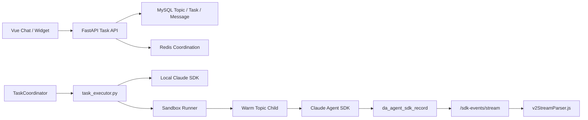
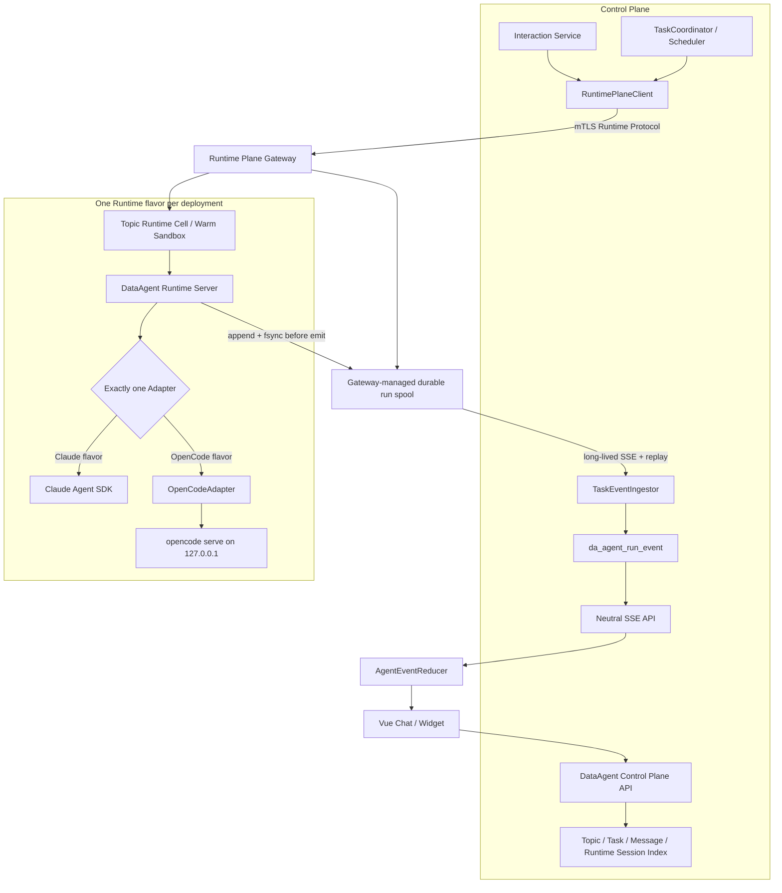

# DataAgent Runtime Plane and Single-Active Adapter

**Date:** 2026-08-30
**Goal:** 在业务动机和 OpenCode 强制契约均通过 go/no-go 后，把 Agent 执行从 DataAgent 控制面分离为单激活 Runtime Plane，使一次部署可选择 Claude Agent SDK 或 OpenCode，同时保持统一的执行、事件、交互、安全和恢复语义。
**Tech Stack:** Control Plane（Python、FastAPI、AnyIO、MySQL 8、Redis）、Runtime Plane（Python 3.11+、FastAPI、HTTP/SSE、Docker、Sandbox）、Claude Agent SDK、OpenCode Server、Vue 3
**Plan:** [2026-08-30-dataagent-runtime-plane-adapter-plan.md](../plans/2026-08-30-dataagent-runtime-plane-adapter-plan.md)

## Scope

### In Scope

- DataAgent Control Plane 与 Runtime Plane 的服务边界和网络协议。
- 部署期 `claude_agent_sdk | opencode` 二选一、应用生命周期内固定的 Runtime。
- Runtime Gateway、Topic Runtime Cell、Gateway-managed durable event spool 和单一 Adapter。
- 版本化 Runtime Protocol、Agent Event Protocol、Interaction Protocol 和 capability manifest。
- Claude Agent SDK 与 OpenCode Server 的 adapter/transport 边界。
- 厂商事件到中立事件、Canonical Tool ID、权限、Question、Plan、Session、取消和错误映射。
- 服务身份、run capability、execution secret envelope、Loopback OpenCode 认证和 secret 生命周期。
- Cell 丢失、Gateway 重启、事件重放、超时、重试和部分结果语义。
- Neutral Event 持久化/API/前端 reducer 与旧 Chat V2 兼容投影。
- Runtime flavor 镜像、部署锁、灰度、分层验证和阶段化 backout。

### Dependencies

本设计依赖单独的 `DataAgent Conversation and Context Model` 提案提供版本化 `ContextBundle`。在该提案合入前，本设计可以完成契约 spike，但不能开始 Runtime Plane 实现。两份方案的唯一领域输入耦合点是 `ContextBundle`；本设计不拥有消息存储、History Query 或 Context Policy。

### Non-Goals

- 不在同一部署中按用户、Topic、Agent Profile 或请求动态选择 Runtime。
- 不支持运行中热切换，不做 Claude 失败后自动切 OpenCode。
- 不跨 Runtime 复制原生 Session ID。
- 不让 Control Plane 同时直连 OpenCode Server 和 Claude SDK。
- 不把 OpenCode npm SDK/Node Sidecar 或 Go SDK嵌入 Python 控制面。
- 不在没有明确业务 Owner、目标环境和可量化收益时为“抽象而抽象”。
- 不自研完整 Agent Loop；Pi Agent Core 属于另一条产品路线。
- 不在本设计中重新定义 Conversation Message、History 或 Context selection。

## Motivation and ROI Gate

### Primary Driver

本方案的首要目标是降低 DataAgent 对单一 Agent Runtime 的运营锁定，使部署方可以在发布时选择 Claude Agent SDK 或 OpenCode，并让未来候选 Runtime 只实现稳定协议，而不修改 Task、消息、权限 API 和前端。

可能产生价值的场景包括：

- 某些部署环境不允许或不希望依赖 Claude Code/Anthropic 运行链。
- 需要利用 OpenCode 的多 Provider 生态或独立发行节奏。
- 需要把运行工具的容器从持有 DataAgent 业务 MySQL 凭据的控制面中隔离。
- 需要用中立事件和协议降低前后端对 Anthropic 原生 block 的锁定。

这些是架构收益，不自动等价于业务 ROI。写任何生产代码前必须由产品/交付 Owner 补齐：

```text
target_environment
business_owner
primary_driver            compliance | provider_choice | cost | availability | vendor_independence
expected_benefit
deadline
production_open_code_need true | false
```

没有命名目标环境和 Owner 时，本提案为 `NO-GO`。

### Rough Effort

以下仅用于立项判断，不是排期承诺：

| Workstream | Estimate |
| --- | --- |
| Business/contract spike and pinned OpenCode validation | 1–2 engineer-weeks |
| Runtime/Event/Security contracts and fake Runtime shell | 2–4 engineer-weeks |
| Claude baseline extraction and compatibility projection | 3–5 engineer-weeks |
| Neutral event store/API/frontend migration | 2–4 engineer-weeks |
| OpenCode adapter, interactions and provider/skill integration | 3–6 engineer-weeks |
| Deployment, Cell recovery, performance and production hardening | 2–4 engineer-weeks |
| Total | roughly 13–25 engineer-weeks, excluding waiting time for provider/environment access |

如果预期收益不能覆盖该量级以及双 Runtime 持续回归成本，应保留当前 Claude 拓扑，只实施 Conversation/Context 提案。

## Hard Go / No-Go Gates

### Gate 0: Business Need

必须有明确 Owner、目标环境、主要驱动、预期收益和生产时间窗口。失败则停止本方案，Conversation/Context 方案继续独立推进。

### Gate 1: OpenCode Contract Spike

选定并固定一个 OpenCode release、checksum、license 和安装来源，使用真实 `opencode serve` 验证：

- health/version 与完整 OpenAPI fixture。
- Session create/get/prompt_async/abort/resume。
- 长连接 SSE、断线重连与 part/message 顺序。
- Remote MCP、Skills、Provider credential 注入和清理。
- API 发起的 permission ask/reply/reject。
- Question ask/reply/reject，包含 workspace/directory routing。
- Plan approval/exit 后继续 build agent。
- Server/Cell 重启后的 pending interaction 行为。
- 同一固定版本内 endpoint、payload 和事件类型稳定。

OpenCode 官方 Server 提供 HTTP、OpenAPI、SSE、Session abort 和 Basic Auth；Server password 通过 `OPENCODE_SERVER_PASSWORD` 配置。[OpenCode Server documentation](https://opencode.ai/docs/server/)

但近期官方仓库仍能看到 permission/question routing 和 restart 后 pending 状态问题，例如 [#36835](https://github.com/anomalyco/opencode/issues/36835)、[#23843](https://github.com/anomalyco/opencode/issues/23843) 和 [#15386](https://github.com/anomalyco/opencode/issues/15386)。因此文档存在 endpoint 不代表 DataAgent 所需的暂停/恢复语义已经生产可用。

### Gate Outcome

- `GO`：Gate 0/1 全部通过，才允许进入 Runtime/Event/Security 实现。
- `NO-GO-business`：停止 Runtime Plane 工作，保留当前 Claude 拓扑。
- `NO-GO-contract`：OpenCode 只保留 spike/experimental 报告；不实现双镜像、数据面拆分或前端 Neutral Event 迁移。
- `RETRY-WITH-OTHER-RUNTIME`：如果选择 Qwen Code 等候选，必须重新执行同一 Gate，不能复用 OpenCode 的乐观假设。

抽象层不会因为“未来也许有用”默认继续实施。Gate 失败后的明确决策是：只保留 Conversation/Context 的 `ContextBundle` 和当前 Claude renderer，不为不可生产的第二 Runtime 支付控制面/数据面拆分成本。

## Candidate Runtime Comparison

| Dimension | Claude Agent SDK | OpenCode | Qwen Code SDK | Pi Agent Core |
| --- | --- | --- | --- | --- |
| Programmable boundary | Official Python/TypeScript SDK | Official headless HTTP Server and JS/TS SDK | TypeScript SDK, still evolving | TypeScript low-level agent primitives |
| Python DataAgent integration | Direct; current production baseline | Python `httpx + SSE` to official Server | Requires Node process/daemon boundary | Requires Node process and a DataAgent-owned harness |
| Session/stream/cancel | Implemented in current path | Server exposes Session, SSE and abort | Semantics are close but need independent pinned-version Gate | Application owns more session/event persistence |
| Permission/question/plan | Current baseline is feature-complete | Mandatory Gate due routing/restart issues | Permission support is promising; production maturity must be re-evaluated | Product-grade pause/resume must be built by DataAgent |
| MCP/Skills | Current native integration | MCP and Agent Skills available | Supports MCP; Skill conventions require validation | DataAgent must assemble more of the product contract |
| Migration cost | Lowest | Medium | Medium-high | High |
| Decision | Baseline Runtime | Preferred second Runtime only after Gate 1 | First alternative candidate if OpenCode Gate fails | Different strategy: own the Agent Loop, not a drop-in adapter |

OpenCode is preferred over embedding the npm SDK because the official Server gives Python a process-isolated HTTP/SSE boundary. Qwen Code remains the next candidate, but must run the same Gate rather than inherit OpenCode assumptions. Pi is appropriate only if DataAgent deliberately chooses to own the Agent Loop, tool scheduler and persistence semantics.

## Current State



现状耦合：

| Boundary | Current location | Coupling |
| --- | --- | --- |
| SDK execution | `core/task_executor.py` | Claude options/types/session lifecycle |
| Shared helpers | `core/agent_runtime.py` | provider/MCP/system prompt/Claude behavior mixed |
| Event writing | `core/sdk_block_writer.py` | Python class-name recognition |
| UI stream | `v2StreamParser.js` | Anthropic native block events |
| Interaction | `permission_gate.py`, executor/store | Claude tool names and SDK records |
| Session | `chat_conversation_id` | untyped Claude session ID |
| Deployment | requirements/Dockerfiles | Claude dependency installed everywhere |
| Data access | runtime child | child writes DataAgent business MySQL |

现有 `TaskCoordinator`、Redis Lease、Sandbox、warm Topic affinity、Portal MCP 和 Skills bundle 是可复用基础。

现有 Chat V2 投影契约不是废弃负担，而是兼容迁移资产：

- `dataagent/contracts/sdk-block-projection/cases.json`
- `tests/test_sdk_block_projection_contract.py`
- `__tests__/sdkBlockProjection.contract.spec.js`
- [2026-05-31-chat-v2-design.md](2026-05-31-chat-v2-design.md)
- [2026-06-08-chat-v2-only-cleanup-design.md](2026-06-08-chat-v2-only-cleanup-design.md)

## Problem

### Vendor Semantics Cross Every Layer

只封装 `query()` 无法解除锁定；厂商消息、工具名、权限回调、Session、历史 block 和前端 parser 都需要边界。

### OpenCode Is a Server Boundary, Not a Python Library Drop-In

Claude Agent SDK 是 Python/子进程式入口；OpenCode 对当前 Python DataAgent 最稳定的边界是官方 headless Server。把 npm SDK 嵌入控制面会增加 Node Sidecar 生命周期；Go 没有必要成为新业务运行时。OpenCode flavor 应由 Python adapter 通过 `httpx + SSE` 调 loopback `opencode serve`。

### Removing MySQL Credentials Creates a New Security Channel

Runtime Plane 不持有业务 MySQL 是安全收益，但 Control -> Gateway -> Cell 的身份、授权和 Provider secret 传递如果不明确，会退化成共享 token 和明文环境变量。

### A Local Cell Journal Can Regress Durability

现状 child 直接写 MySQL；如果新 journal 只在 Cell writable layer，OOM/reaper/host restart 会丢未摄取事件。新设计必须至少在 Cell 丢失时保住“已向用户可见”的事件，并定义不可恢复区间和 Task 终态。

### Extra Network Hop Can Regress Chat Latency

正常路径若使用轮询，首字和增量延迟会显著增加。必须定义长连接 ingest、flush/batch 参数和相对现状的延迟预算。

## Design

### Architecture



Control Plane only knows Runtime/Event/Context contracts. Gateway routes a run to a Topic-affine Cell. Runtime Server creates exactly one adapter based on the image flavor; `AgentRunRequest` has no runtime-selection field.

### Module Boundaries

Control Plane replaces the single module with a package. The old file cannot coexist with the package:

```text
core/agent_runtime.py                         # delete
core/agent_runtime/
  __init__.py
  contracts.py
  capabilities.py
  bootstrap.py
  client.py
  session_store.py
  event_ingestor.py
  interaction_service.py
  tool_identity.py
  tool_policy.py
  security.py
```

Runtime Plane:

```text
runtime_plane/
  app.py
  api.py
  contracts.py
  manifest.py
  supervisor.py
  event_spool.py
  interaction_waiter.py
  workspace.py
  security.py
  policy_enforcer.py
  adapters/
    claude_agent_sdk.py
    claude_event_normalizer.py
    opencode.py
    opencode_event_normalizer.py
  transports/
    opencode_server.py
```

Rules:

- Only Claude adapter imports `claude_agent_sdk`.
- Only OpenCode adapter/transport knows OpenCode endpoints/events.
- Runtime Plane has no DataAgent business MySQL credentials.
- Runtime Plane receives immutable `ContextBundle`, execution policy, workspace spec and short-lived execution secrets.
- Adapter normalizes native events before append; vendor payload never crosses Runtime Protocol.
- Control Plane owns Task/Interaction/Session index/business persistence.

### Runtime Request

```python
class AgentRunRequest:
    runtime_protocol_version: str
    agent_event_protocol_version: str
    run_id: str
    task_id: str
    task_attempt_id: str
    topic_id: str
    purpose: Literal["chat", "followup", "skill_compare", "model_probe"]
    context: ContextBundle
    model: ModelTarget
    session: RuntimeSessionRef | None
    workspace: WorkspaceSpec
    skills: list[SkillSpec]
    mcp_servers: list[McpServerSpec]
    policy: ExecutionPolicySnapshot
    limits: RunLimits
    secret_envelope: ExecutionSecretEnvelope
```

`runtime_kind` may be included as a server-generated audit/consistency value, never as client routing choice. Duplicate `(run_id, task_attempt_id)` returns the existing run and cannot repeat tool execution.

### Runtime Protocol

```http
GET  /v1/runtime/manifest
GET  /v1/runtime/health
POST /v1/runs
GET  /v1/runs/{run_id}
GET  /v1/runs/{run_id}/events/stream?after_sequence=100
GET  /v1/runs/{run_id}/events?after_sequence=100&limit=200
POST /v1/runs/{run_id}/cancel
POST /v1/runs/{run_id}/interactions/{interaction_id}/resolve
```

Normal ingest uses the long-lived SSE endpoint. `after_sequence` is both initial replay and reconnect recovery cursor; it is not a polling interval. The paged endpoint is diagnostic/recovery fallback only.

### Service Identity and Authorization

#### Control Plane to Gateway

- Mutual TLS with an environment-specific internal CA.
- Control certificate SAN: `spiffe://opendataworks/dataagent/control-plane`.
- Gateway certificate SAN: `spiffe://opendataworks/dataagent/runtime-gateway`.
- Certificates valid at most 30 days, automated rotation with 24-hour overlap, revoked certificates rejected at readiness.
- TLS 1.3; hostname/SAN verification required; no insecure development fallback in production profile.

#### Gateway to Runtime Cell

Gateway signs a per-run Ed25519 capability token:

```text
iss=runtime-gateway
aud=cell_id
sub=run_id
task_attempt_id
scopes=start,events,resolve,cancel
jti
iat / exp                 # acceptance window <= 60 seconds
```

Cell verifies the read-only Gateway public key and rejects wrong audience, expired/replayed `jti`, unknown scope and task-attempt mismatch. Clock skew allowance is at most 30 seconds. Capability authorizes one run; it is not a general service token.

### Execution Secret Envelope

Provider/MCP secrets remain in the Control Plane secret source. Runtime Cell publishes an ephemeral X25519 public key in its signed manifest. Control Plane creates an RFC 9180 HPKE envelope using X25519/HKDF-SHA256/AES-256-GCM:

```text
envelope_id / key_id
run_id / task_attempt_id / cell_id
issued_at / expires_at          # accept within <= 60 seconds
nonce
ciphertext                      # provider/MCP secrets only
content_hash
```

Rules:

- Envelope metadata is authenticated as associated data.
- Cell decrypts once after run/capability validation; replayed envelope ID is rejected.
- Plaintext exists only in run process memory and is released at terminal/cancel.
- Plaintext/ciphertext never enters logs, event spool, ContextSnapshot, Session metadata or workspace.
- Cancel revokes an unconsumed envelope and stops the run. If an underlying long-lived provider credential is compromised, actual revocation occurs at the provider/secret store; envelope revocation cannot revoke the source credential.
- Runtime readiness fails if crypto key rotation or replay cache is unavailable.

Development can use a local CA and generated keys, but cannot replace the protocol with a shared plaintext token.

### OpenCode Loopback Authentication

OpenCode officially accepts Basic Auth through `OPENCODE_SERVER_PASSWORD`. The supervisor generates a random 256-bit password and explicit random username for every OpenCode process, binds only `127.0.0.1` on a random port, disables CORS and rotates credentials on process restart.

Because OpenCode reads the password from environment, the supervisor injects it only into that child process environment; it is not a container-level deployment variable or file. The Python adapter receives the credential through the in-memory supervisor handle. Same-UID processes inside a Runtime Cell are one trust boundary; Basic Auth protects accidental/remote loopback access, not malicious code already able to inspect the Cell process table. Sandbox/container isolation remains the security boundary.

Provider credentials must use an ephemeral tmpfs auth/config overlay or per-credential process lifetime. A production OpenCode flavor is `NO-GO` if the pinned version persists provider tokens into `/mnt/home`, logs them, or cannot reliably clear them before warm reuse.

### Gateway-Managed Durable Event Spool

Journal files are not stored only in the Cell writable layer. Gateway creates a run-scoped directory under:

```text
/var/lib/dataagent-runtime/journals/{run_id}/
```

Only that directory is mounted into the Cell. Runtime Server appends length-delimited, checksummed AgentEvents and fsyncs before publishing them to the Gateway stream. Gateway owns replay/ack/retention metadata and can continue serving committed spool records after the Cell exits.

Ack flow:

1. Runtime appends + fsyncs event sequence N.
2. Gateway exposes N on long-lived SSE.
3. Control validates and commits N to MySQL.
4. Control acknowledges highest contiguous sequence.
5. Gateway cleans spool only after terminal event is acknowledged and retention grace expires.

Spool contains normalized, redacted AgentEvent only—never secrets or native raw payload.

### Cell Loss Recovery

Cell death is a terminal boundary for the current `run_id`; the system never transparently resumes the same run in a new Cell.

1. Gateway confirms process/container loss and seals the spool.
2. All fsynced events remain replayable and are ingested by Control Plane.
3. Control Plane appends a control-originated `run.failed` with the next sequence and `code=runtime_cell_lost`, including `last_runtime_sequence` and `event_loss_possible`.
4. Task becomes failed; assistant semantic message may retain partial content for diagnostics but is not finalized as a successful answer.
5. Pending interactions become cancelled with `runtime_cell_lost`.
6. Write-capable runs are never automatically retried because tool side effects may already exist.
7. Read-only/idempotent runs may create a new `run_id`/attempt only under explicit retry policy; audit links both attempts.

`event_loss_possible=false` when Gateway spool survives and all emitted events were fsynced. Host-disk loss or corruption sets it true. Already delivered browser events remain visible as failed partial execution; they are not silently removed.

### Latency Budget

Normal event delivery is streaming, not polling:

- Runtime append-to-Gateway flush target: <= 25 ms.
- Control ingest batch: maximum 10 events or 20 ms, whichever comes first; terminal/interaction events flush immediately.
- Runtime SSE heartbeat: <= 15 seconds.
- P95 incremental first-content overhead relative to current child -> MySQL path: < 100 ms.
- P99 incremental event overhead: < 250 ms.
- No event may be buffered solely to improve batch size beyond the 20 ms limit.

Performance gate compares identical prompts/model/environment against the current Claude baseline. If P95 overhead exceeds budget, release blocks until batching/network/persistence is corrected; raising UI timeout is not mitigation.

### Agent Event Protocol v1

Canonical path:

```text
dataagent/contracts/agent-events/v1/
  agent-event.schema.json
  agent-event-record.schema.json
  compatibility-cases.json
  README.md
  examples/
```

Envelope:

```text
spec_version
run_id / task_id / topic_id
sequence
occurred_at
source { emitter, runtime_kind, runtime_version, adapter_version }
type
data
```

`emitter` is `runtime` for normal events and `control` only for transport/cell-loss terminal synthesis.

Explicit union:

```text
run.started
turn.started
content.started / content.delta / content.completed
tool.started / tool.progress / tool.completed
interaction.requested / interaction.resolved
usage.updated
turn.completed
run.completed / run.suspended / run.failed / run.cancelled
```

Turn is explicitly closed by `turn.completed`; consumers never infer closure from the next turn or terminal event.

Sequence/state invariants:

- sequence starts at 1, strictly increases by 1 within a run.
- first event is `run.started`.
- content/tool/interaction IDs pair exactly once.
- every `turn.started` has one `turn.completed` unless the run terminates abnormally; abnormal terminal contains `open_turn_id`.
- exactly one run terminal event.
- no runtime event after terminal/seal.
- Cell-loss control terminal seals the run; later runtime records are rejected and quarantined.

Limits and redaction remain schema-enforced: event 256 KiB, delta 32 KiB, tool input 128 KiB, inline result 128 KiB, table preview 100 rows/128 KiB, error message 4 KiB. Larger results become Artifact refs owned by the Conversation/Artifact boundary.

### Compatibility Projection

Neutral migration extends the existing golden fixture pattern instead of bypassing it:

```text
AgentEvent compatibility fixture
  -> expected legacy da_agent_sdk_record rows
  -> existing backend SDK-record projector
  -> existing frontend v2StreamParser
  -> expected canonical blocks
```

`compatibility-cases.json` covers thinking, text, tool success/error, permission, question, plan and terminal states. Claude extraction cannot ship until both the new neutral projector and existing Python/Vue consumers pass the same cases.

New tasks eventually write only `da_agent_run_event`; old `/sdk-events` remains read-only. The reverse compatibility projector exists only during a bounded migration window and is removed in a separate cleanup proposal.

### Event Persistence and Cursor Semantics

```text
da_agent_run_event
  id             BIGINT AUTO_INCREMENT PK
  topic_id       VARCHAR(64)
  task_id        VARCHAR(64)
  run_id         VARCHAR(64)
  sequence       BIGINT
  spec_version   VARCHAR(32)
  event_type     VARCHAR(64)
  data_json      JSON/LONGTEXT
  occurred_at    DATETIME(3)
  created_at     DATETIME(3)
  UNIQUE(run_id, sequence)
  INDEX(task_id, id)
  INDEX(created_at, id)
  INDEX(topic_id, created_at, id)
```

V1 SSE cursor is task-scoped: `/tasks/{task_id}/events?after_id=`. Exactly one `TaskEventIngestor` owns a Task at a time and serializes all attempts/events for that Task; the coordinator does not run concurrent attempts for one Task. Therefore a task cursor cannot advance past an uncommitted earlier event for the same task. Other tasks' AUTO_INCREMENT values do not affect a task-scoped query.

V1 does not expose a global/topic-wide `after_id` feed. If such a feed is added later, it must use a commit-ordered cursor/outbox rather than assuming AUTO_INCREMENT equals commit order.

Archive jobs use `(created_at,id)` or `(topic_id,created_at,id)` indexes and only archive terminal runs older than retention with acknowledged spool cleanup.

### Error Codes

```text
runtime_artifact_mismatch
runtime_binary_version_unsupported
runtime_protocol_version_unsupported
agent_event_protocol_version_unsupported
runtime_capability_missing
runtime_session_missing
runtime_session_incompatible
runtime_cell_lost
runtime_spool_corrupt
runtime_event_sequence_gap
runtime_event_schema_invalid
provider_auth_failed
provider_model_unavailable
interaction_timeout
run_timeout
run_idle_timeout
run_cancelled
```

`runtime_binary_version_unsupported` is for the pinned Claude/OpenCode implementation version. `runtime_protocol_version_unsupported` is for Control/Gateway/Cell wire incompatibility. No unqualified generic version error is used.

### Interactions

Runtime protocol supports explicit `permission`, `question` and `plan_approval` requests. Runtime Cell writes `interaction.requested` before waiting. Control Plane persists Interaction, receives user decision, then calls resolve with `interaction_id + version`. Cell applies once, emits `interaction.resolved`, and resumes adapter.

Cell loss cancels the Interaction; a new run cannot reuse the old interaction ID. OpenCode adapter must include directory/workspace routing captured from the original request and verify the post-reply event, not trust HTTP 200 alone.

### Canonical Tools and Policy

Agent Profile stores Canonical Tool IDs such as `filesystem.read`, `shell.execute`, `portal.workflow.publish`. Control compiles `ExecutionPolicySnapshot`; Runtime `PolicyEnforcer` verifies signature/version and checks each call. Adapter maps canonical IDs to vendor tools. Unknown tools and invalid mappings fail closed.

UI title/summary are derived display metadata, not injected into real tool input. Workspace escape and write-risk checks run in Runtime Plane even if adapter/vendor has its own permission layer.

### Runtime Session

```text
da_agent_runtime_session
  topic_id
  runtime_kind
  external_session_id
  workspace_fingerprint
  context_snapshot_id
  committed_message_seq
  config_fingerprint
  state                  active | stale | invalid
  metadata_json          no secrets
  last_used_at
```

Resume validates Runtime kind, ContextBundle lineage, workspace/config fingerprints and actual external Session readability. Cross-Runtime migration always rebuilds from Conversation/Context; external IDs are never copied.

### Deployment Selection

Authoritative configuration:

```dotenv
DATAAGENT_AGENT_RUNTIME=claude_agent_sdk
OPENDATAWORKS_DATAAGENT_RUNTIME_IMAGE=opendataworks/dataagent-runtime-plane:<version>-claude
```

OpenCode flavor also defines binary path/startup timeout, but no client API accepts runtime selection. Control image is vendor-free; Runtime images:

```text
dataagent-control-plane:<version>
dataagent-runtime-plane:<version>-claude
dataagent-runtime-plane:<version>-opencode
```

Manifest and DB deployment lock verify env, image flavor, Runtime Protocol, Agent Event Protocol, tool catalog fingerprint and build revision before Coordinator readiness.

## Interfaces / Data Model

### Manifest

```json
{
  "artifact_flavor": "opencode",
  "runtime_kind": "opencode",
  "runtime_binary_version": "<pinned>",
  "runtime_protocol_versions": ["v1"],
  "agent_event_protocol_versions": ["v1"],
  "capabilities": {
    "session_resume": true,
    "cancel": true,
    "remote_mcp": true,
    "permission": true,
    "question": true,
    "plan_approval": true
  },
  "tool_catalog_fingerprint": "...",
  "cell_public_key": "...",
  "build_revision": "..."
}
```

### Deployment Lock

```text
da_agent_runtime_deployment
  deployment_key               primary
  runtime_kind
  runtime_binary_version
  runtime_protocol_version
  agent_event_protocol_version
  artifact_fingerprint
  initialized_at / updated_at
```

The lock is created only when split topology is enabled. Legacy application versions ignore the additive table. Changing env cannot mutate the lock; cross-Runtime changes require offline migration.

### Runtime Capabilities

Capabilities are release gates, not silent fallback switches. A selected flavor missing a mandatory capability is not ready. Plan mode is disabled at product level only by an explicit product decision and profile migration, never because an adapter silently ignores it.

## Rollout and Backout

### Phase 0: Gates and Contracts

- No runtime code or schema changes.
- Backout: close proposal/spike; current Claude path unchanged.

### Phase 1: Runtime Shell Behind Existing Events

- Deploy Runtime Gateway/Claude Cell but keep Control feature flag `agent_execution_transport=legacy|runtime_plane` default legacy.
- New Runtime Plane may project back to old SDK-record path; frontend unchanged.
- Backout: stop new submissions, wait/cancel active Runtime runs, switch flag to legacy, then stop Gateway/Cells. No deployment lock required yet.

### Phase 2: Neutral Event Store and Frontend

- Dual-read old tasks; new tasks write Neutral Event and compatibility projection during a bounded window.
- Backout: stop submissions, drain active tasks, revert frontend/API to `/sdk-events`, restore compatibility writer as primary. Keep `da_agent_run_event` rows and spool for audit.

### Phase 3: Split Production Topology and Deployment Lock

- Control image no longer contains vendor SDK; Runtime image is mandatory.
- Before backout: stop Coordinator, ensure no waiting/running/interaction tasks, export run/session/spool status, deploy legacy combined Claude image, remove Runtime services from compose.
- Keep `da_agent_runtime_deployment` row; legacy code ignores it. Do not delete the row because a later split deployment must still detect prior Runtime lineage.
- Restore legacy provider-secret injection path only after Runtime services are unreachable and credentials are rotated if exposure is suspected.

### Phase 4: OpenCode Canary

- Use a separate environment/database lock. Do not hot-switch a Claude production environment.
- Backout: stop OpenCode canary and preserve neutral events/messages; rebuild a separate Claude environment or perform explicit offline migration. Never reuse OpenCode Session ID.

## Risks / Alternatives

### Risks

- OpenCode permission/question interfaces can regress between versions; pin release and execute real contract tests.
- Runtime event hop can increase latency; long-lived stream and release budget are mandatory.
- Gateway spool can consume disk during Control outage; quotas, lag/age alerts and fail-closed admission are required.
- Secret envelope adds key lifecycle complexity; readiness and rotation tests are release blockers.
- Two Runtime flavors double production verification and supply-chain surface.
- Neutral protocol may accidentally encode Claude semantics; OpenCode fixtures must be written before protocol freeze.

### Alternatives Rejected

#### Build Runtime Plane Even If Gate 1 Fails

This pays the full topology cost without a production second Runtime. Explicit outcome is no implementation.

#### Control Plane Calls OpenCode Directly and Wraps Claude Separately

Control would own two Session/event/interaction clients and remain vendor-coupled.

#### Node SDK Sidecar or Go Service

Adds another application runtime without improving the stable boundary already offered by official HTTP Server.

#### Cell-Local-Only Journal

Regresses durability relative to direct MySQL writes. Gateway-managed spool preserves fsynced events across Cell loss.

#### Poll Runtime Events

Adds avoidable chat latency and load. Normal path is long-lived SSE; paged API is recovery only.

#### Global OpenCode Server

Mixes Topic workspace, HOME, credentials and failure domain; violates Sandbox affinity.

#### Automatic Cross-Runtime Fallback

Cannot know whether tools already caused side effects and cannot preserve Session semantics.

## Verification

### Contract Layer

- Pinned OpenCode real-server fixtures for manifest, session, SSE, abort, MCP, permission, question and plan.
- JSON Schema/Pydantic/TypeScript AgentEvent fixtures.
- `turn.completed`, abnormal open-turn terminal, sequence gap and terminal seal cases.
- AgentEvent -> legacy SDK record -> existing Python/Vue canonical block convergence.
- Runtime/binary/event protocol error-code fixtures.

### Security Layer

- mTLS wrong CA/SAN/expired/revoked certificate fails readiness.
- Capability wrong audience/scope/attempt, expired/replayed `jti` fails closed.
- HPKE wrong cell/run/key, expired/replayed envelope fails closed.
- No secret appears in logs, spool, ContextSnapshot, workspace or Runtime Session metadata.
- OpenCode loopback is unreachable outside Cell and password rotates on restart.
- Warm reuse cannot observe prior run provider/MCP credentials.

### Recovery Layer

- Runtime Cell killed after emitted/fsynced event: spool replays all confirmed records and Control synthesizes `runtime_cell_lost` terminal.
- Cell killed before first event, during tool, during interaction and after terminal-before-ack.
- Gateway restart reopens spool and resumes `after_sequence`.
- Spool checksum corruption quarantines run and fails task.
- Write-capable Cell loss never retries automatically.

### Performance Layer

- Same Claude prompt/model/environment before/after split.
- P50/P95/P99 time-to-first-content and per-event overhead.
- Release blocks above P95 +100 ms or P99 +250 ms incremental budget.
- Control disconnect backlog, spool disk quota and catch-up throughput.

### Layered Real E2E

Release-blocking suite for each production Runtime:

- text stream and terminal message
- Session resume
- cancel
- permission allow/deny
- question answer
- workspace escape denial
- Cell loss terminal/replay

Periodic/nightly suite:

- thinking/tool-progress permutations
- plan approval -> build
- all Portal MCP/Skill scenarios
- long context and large artifact refs
- Gateway restart, spool quota, concurrency/capacity
- model/provider matrix

Automation entrypoint: `scripts/validate_live_nl2sql_scenarios.py --runtime <kind> --suite release-blocking|nightly`. Release-blocking target duration is <= 30 minutes; nightly target <= 2 hours. CI/release owner is the DataAgent maintainers group; artifacts and exact environment are written to `docs/reports/`.

No flavor is called production-ready without real Provider E2E. Unit/fixture-only validation is insufficient.

## External References

- [Claude Agent SDK session resume](https://platform.claude.com/cookbook/claude-agent-sdk-05-building-a-session-browser)
- [OpenCode Server](https://opencode.ai/docs/server/)
- [OpenCode SDK](https://opencode.ai/docs/sdk/)
- [OpenCode Agent Skills](https://opencode.ai/docs/skills/)
- [OpenCode permission API routing issue #36835](https://github.com/anomalyco/opencode/issues/36835)
- [OpenCode Question workspace routing issue #23843](https://github.com/anomalyco/opencode/issues/23843)
- [OpenCode pending permission restart issue #15386](https://github.com/anomalyco/opencode/issues/15386)
- [Qwen Code TypeScript SDK](https://qwenlm.github.io/qwen-code-docs/en/developers/sdk-typescript/)
- [Pi documentation](https://pi.dev/docs/latest)
